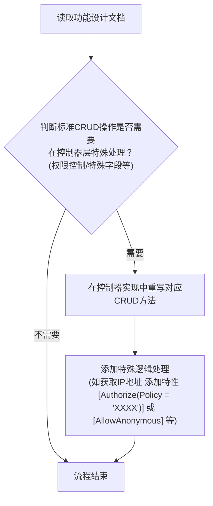

# MMB 标准 CRUD 控制器介入技能

按以下流程执行，优先基于仓库检索结果与框架源码判断，不依赖猜测。

## 强制约束

1. 禁止修改任何 `MGC` 目录文件。
2. 仅处理标准 CRUD 的控制器介入：`AddAsync`、`EditAsync`、`DeleteAsync`、`GetInfoAsync`、`GetListAsync`。
3. 先检索已有控制器、策略常量、异常类型、命名空间风格，再落地代码。
4. 涉及业务异常时，遵循 `mmb-exception-handling`。
5. 非标准 CRUD 新接口，改用 `mmb-controller-impl`。
6. 若项目已启用全局默认鉴权（如 FallbackPolicy / 统一授权中间件），不要为“仅需登录即可访问”的动作额外加 `[Authorize]`。

## 流程图



## 使用场景识别

当用户提供任务文档（如 `UserManagement.md`）时，先做范围判断：

1. 识别标准 CRUD 任务（应处理）：
- 优先按语义识别：获取列表、获取详情、添加、修改、删除
- 编号仅作辅助：`T-{模块}-CRUD-01~05` 是常见示例，不要求固定编号
2. 识别非 CRUD 任务（跳过）：
- `T-{模块}-PWD-*` 密码相关
- `T-{模块}-STATUS-*` 状态变更
- `T-{模块}-PROFILE-*` 个人中心
- 其他自定义业务接口

## 功能范围

### 包含的内容（仅标准 CRUD 控制器介入）

1. 判断标准 CRUD 是否需要控制器层特殊处理（权限、请求字段处理、返回信息调整）。
2. 在非 `MGC` 的 `partial controller` 中重写标准 CRUD 方法。
3. 为标准 CRUD 方法添加/调整控制器层特性（优先 `[AllowAnonymous]` 或 `[Authorize(Policy=...)]`）。
4. 选择正确介入点（`public override` 或 `protected override`）。

### 不包含的内容

1. 非标准 CRUD 接口新增或扩展（改用 `mmb-controller-impl`）。
2. 服务层业务实现与实体特性设计（改用 `mmb-service-crud-impl`）。
3. 仓储实现、复杂聚合、批量导入导出、报表统计。
4. `PWD/STATUS/PROFILE` 等非 CRUD 任务的控制器实现。

## 执行步骤

1. 读取功能设计文档，圈定受影响的 CRUD 动作（Add/Edit/Delete/GetInfo/GetList）。
2. 检索实体对应控制器类型，确认类名、命名空间、请求模型类型。
3. 按“介入点矩阵”选择重写方式（`public override` 或 `protected override`）。
4. 在 `Application/Controllers` 新建或扩展同名 `partial` 控制器，不修改 `MGC` 文件。
5. 添加特殊逻辑（鉴权、IP、字段注入、自定义返回消息等）。
6. 编译验证（至少模块级 `dotnet build`）。

## 介入点矩阵

基于 `Materal.MergeBlock.Web.Abstractions.Controllers.MergeBlockController` 源码，标准 CRUD 默认由基类实现，且包含以下可重写点：

1. `AddAsync`:
- `public virtual Task<ResultModel<Guid>> AddAsync(TAddRequestModel requestModel)`
- `protected virtual Task<ResultModel<Guid>> AddAsync(TAddModel model, TAddRequestModel requestModel)`
2. `EditAsync`:
- `public virtual Task<ResultModel> EditAsync(TEditRequestModel requestModel)`
- `protected virtual Task<ResultModel> EditAsync(TEditModel model, TEditRequestModel requestModel)`
3. `GetListAsync`:
- `public virtual Task<CollectionResultModel<TListDTO>> GetListAsync(TQueryRequestModel requestModel)`
- `protected virtual Task<CollectionResultModel<TListDTO>> GetListAsync(TQueryModel model, TQueryRequestModel requestModel)`
4. `DeleteAsync`:
- 仅 `public virtual Task<ResultModel> DeleteAsync(Guid id)`
5. `GetInfoAsync`:
- 仅 `public virtual Task<ResultModel<TDTO>> GetInfoAsync(Guid id)`

选择规则：

1. 只改“映射后、调用服务前后”的逻辑，且不改路由/特性：优先重写 `protected`（Add/Edit/GetList）。
2. 需要新增 `[AllowAnonymous]`、`[Authorize(Policy=...)]`、自定义路由/参数校验：重写 `public`。
3. `Delete` 与 `GetInfo` 无 `protected` 扩展点，只能重写 `public`。

## 代码落地模式

在 `{ProjectName}.{ModuleName}.Application/Controllers/{Entity}Controller.cs` 创建非 MGC 文件，写 `partial class` 并重写方法。

示例：仅插入 Add 逻辑（保留基类映射与返回结构）

```csharp
public partial class UserController
{
    protected override async Task<ResultModel<Guid>> AddAsync(AddUserModel model, AddUserRequestModel requestModel)
    {
        model.RegisterIP = GetClientIP();
        return await base.AddAsync(model, requestModel);
    }
}
```

示例：对 Delete 增加策略控制（需重写 public）

```csharp
public partial class UserController
{
    [HttpDelete, Authorize(Policy = YourAuthorizationPolicies.YourPolicy)]
    public override async Task<ResultModel> DeleteAsync([Required(ErrorMessage = "唯一标识为空")] Guid id)
    {
        return await base.DeleteAsync(id);
    }
}
```

鉴权特性使用规则：

1. 公开接口：显式加 `[AllowAnonymous]`。
2. 需要比“默认登录态”更严格的权限：加 `[Authorize(Policy = Xxx)]`。
3. 仅需默认登录态且项目已全局默认鉴权：不额外加 `[Authorize]`。

## 自检清单

1. 是否未修改任何 `MGC` 文件。
2. 是否仅介入标准 CRUD 方法。
3. 是否为每个目标动作选择了正确重写层级（`public` / `protected`）。
4. 若重写 `public`，是否保留正确 HTTP 特性与参数校验特性。
5. 是否避免了无必要的 `[Authorize]`（默认鉴权项目中）。
6. 是否通过编译验证。

## 参考

1. 方法签名速查：`references/crud-hook-signatures.md`
