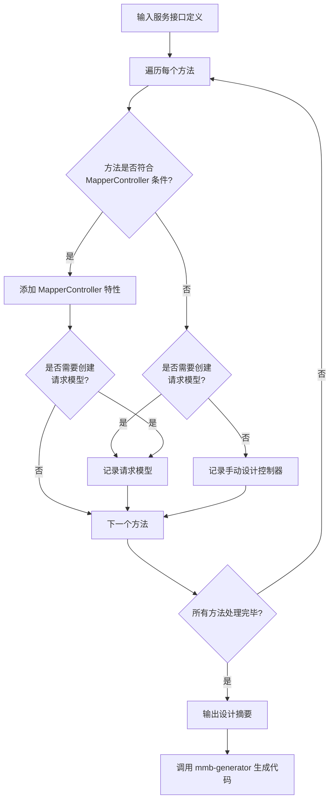

# MMB 控制器设计技能

## 概述

本技能用于根据服务接口定义设计符合 MMB 框架规范的控制器，判断是使用 `[MapperController]` 特性自动生成，还是手动设计控制器接口。

## 核心决策

**核心问题**：服务方法是否可以通过 `[MapperController]` 特性自动生成控制器？

## 工作流程



## 执行步骤

### 第一步：读取服务接口定义

**服务接口来源**：
```
{ProjectName}.{ModuleName}.Abstractions/Services/I{Entity}Service.cs
```

```bash
Read {ProjectName}.{ModuleName}.Abstractions/Services/I{Entity}Service.cs
```

### 第二步：判断每个方法是否可使用 MapperController

#### 可使用 MapperController 的条件

**所有条件必须满足**：
1. ✅ 参数映射简单：复杂类型参数与 ServiceModel 一致，或仅使用简单类型（Guid、int、string、DateTime 等）
2. ✅ 不需要特殊的控制器逻辑（如文件处理、特殊验证等）
3. ✅ 返回类型符合标准规范（见下方返回类型说明）
4. ✅ 不涉及特殊场景（文件上传下载、SSE、WebSocket 等）

#### 必须手动设计控制器接口的条件

**任一条件满足即需手动设计**：
1. ❌ 参数与 ServiceModel 不一致，需要自定义 RequestModel
2. ❌ 需要特殊的控制器层验证或处理
3. ❌ 涉及文件上传（IFormFile）
4. ❌ 涉及文件下载（FileResult）
5. ❌ SSE 流式响应（IAsyncEnumerable 但需要特殊处理）
6. ❌ WebSocket 通信
7. ❌ 需要复杂的参数组合或验证

### 第三步：为可自动生成的方法添加 MapperController 特性

#### ⚠️ 重要：MapperController 与 RequestModel 的命名规则

当使用 `[MapperController]` 特性时，代码生成器会自动创建控制器接口，**但会按照命名规则引用对应的 RequestModel**：

| ServiceModel | 自动引用的 RequestModel |
|-------------|----------------------|
| `LoginModel` | `LoginRequestModel` |
| `ChangeOwnPasswordModel` | `ChangeOwnPasswordRequestModel` |
| `ResetPasswordModel` | `ResetPasswordRequestModel` |
| `QueryUserModel` | `QueryUserRequestModel` |

**因此，添加 `[MapperController]` 特性后，必须手动创建对应的 RequestModel，否则会导致编译错误。**

RequestModel 应创建在：
```
{ProjectName}.{ModuleName}.Abstractions/RequestModel/{Entity}/{Action}RequestModel.cs
```

示例：
```
ZhiTu.Main.Abstractions/
└── RequestModel/
    └── Admin/
        ├── LoginRequestModel.cs              ← 手动创建
        ├── ChangeOwnPasswordRequestModel.cs  ← 手动创建
        ├── ResetPasswordRequestModel.cs      ← 手动创建
        └── SetEnabledRequestModel.cs         ← 手动创建
```

#### 特性参数说明

```csharp
[MapperController(MapperType.{Type}, IsAllowAnonymous = {bool}, Policy = "{PolicyName}")]
```

| 参数 | 类型 | 说明 | 默认值 |
|------|------|------|--------|
| `Type` | `MapperType` | HTTP 方法类型 | 必填 |
| `IsAllowAnonymous` | `bool` | 是否允许匿名访问 | `false` |
| `Policy` | `string?` | 授权策略名称 | `null` |

#### MapperType 选择规则

| HTTP 方法 | MapperType | 使用场景 |
|-----------|------------|----------|
| `GET` | `MapperType.Get` | 查询操作，获取数据 |
| `POST` | `MapperType.Post` | 创建资源或复杂查询 |
| `PUT` | `MapperType.Put` | 完整更新资源 |
| `DELETE` | `MapperType.Delete` | 删除资源 |
| `PATCH` | `MapperType.Patch` | 部分更新资源 |

**方法名启发式规则**：
- 查询类：`Get...`、`Query...`、`Search...`、`Find...` → `MapperType.Get` 或 `MapperType.Post`
- 添加类：`Add...`、`Create...`、`Insert...` → `MapperType.Post`
- 修改类：`Edit...`、`Update...`、`Modify...` → `MapperType.Put` 或 `MapperType.Patch`
- 删除类：`Delete...`、`Remove...` → `MapperType.Delete`

#### 示例

```csharp
// 简单查询 - GET
[MapperController(MapperType.Get)]
Task<UserDTO> GetInfoAsync(Guid id);

// 复杂查询 - POST
[MapperController(MapperType.Post)]
Task<(List<UserListDTO> data, RangeModel rangeInfo)> GetListAsync(QueryUserModel requestModel);

// 创建 - POST
[MapperController(MapperType.Post)]
Task<UserDTO> RegisterAsync(RegisterModel model);

// 更新 - PUT
[MapperController(MapperType.Put)]
Task UpdateInfoAsync(UpdateUserInfoModel model);

// 允许匿名访问
[MapperController(MapperType.Get, IsAllowAnonymous = true)]
Task<string> GetCaptchaImageAsync();

// 需要授权策略
[MapperController(MapperType.Post, Policy = "AdminOnly")]
Task<AdminStatisticsDTO> GetAdminStatisticsAsync();
```

### 第四步：手动设计控制器接口

当方法不满足 MapperController 条件时，在以下位置手动创建控制器接口：

```
{ProjectName}.{ModuleName}.Abstractions/Controllers/I{Entity}Controller.cs
```

#### 控制器接口模板

```csharp
namespace {ProjectName}.{ModuleName}.Abstractions.Controllers;

using {ProjectName}.{ModuleName}.Abstractions.RequestModel.{Entity};
using {ProjectName}.{ModuleName}.Abstractions.DTO.{Entity};

/// <summary>
/// {实体描述}控制器
/// </summary>
public partial interface I{Entity}Controller : IMergeBlockController
{
    /// <summary>
    /// {方法描述}
    /// </summary>
    /// <param name="{ParameterName}">{参数描述}</param>
    [Http{Method}]
    Task<ResultModel<{ReturnType}>> {MethodName}Async({RequestModel} {ParameterName});
}
```

#### 控制器接口返回类型规范

参考 `/mmb-controller-return` 技能：

| Service 返回 | Controller 接口返回 |
|--------------|---------------------|
| `Task` | `Task<ResultModel>` |
| `Task<T>` | `Task<ResultModel<T>>` |
| `Task<(List<T> data, RangeModel rangeInfo)>` | `Task<CollectionResultModel<T>>` |
| `IAsyncEnumerable<T>` (SSE) | `IAsyncEnumerable<T>` |
| 文件流 | `Task<IActionResult>` 或 `Task<FileResult>` |

### 第五步：创建请求模型（如需要）

当服务参数与现有 RequestModel 不一致时，创建自定义请求模型：

#### 请求模型位置

```
{ProjectName}.{ModuleName}.Abstractions/RequestModel/{Entity}/{ModelName}RequestModel.cs
```

#### 请求模型命名规则

| 模型类型 | 命名格式 | 示例 |
|---------|---------|------|
| 添加模型 | `Add{Entity}RequestModel` | `AddUserRequestModel` |
| 编辑模型 | `Edit{Entity}RequestModel` | `EditUserRequestModel` |
| 查询模型 | `Query{Entity}RequestModel` | `QueryUserRequestModel` |
| 操作模型 | `{Action}RequestModel` | `ChangePasswordRequestModel` |

#### 请求模型模板

```csharp
namespace {ProjectName}.{ModuleName}.Abstractions.RequestModel.{Entity};

using System.ComponentModel.DataAnnotations;

/// <summary>
/// {模型描述}
/// </summary>
public class {ModelName}RequestModel
{
    /// <summary>
    /// {属性描述}
    /// </summary>
    [Required(ErrorMessage = "{属性名}为空")]
    public string {PropertyName} { get; set; } = string.Empty;

    // 其他属性...
}
```

#### 请求模型基类选择

| 基类 | 功能 | 使用场景 |
|------|------|---------|
| 无基类 | 基础验证 | 简单请求模型 |
| `PageRequestModel` | 分页 | 需要分页的查询 |
| `IAddRequestModel` | 添加模型标识 | 添加操作（与代码生成器配合） |
| `IEditRequestModel` | 编辑模型标识 | 编辑操作（与代码生成器配合） |
| `IQueryRequestModel` | 查询模型标识 | 查询操作（与代码生成器配合） |

### 第六步：汇总设计结果

输出控制器设计摘要：

```markdown
## 控制器设计摘要

### 设计方案

| 方法名 | 方案 | 说明 |
|--------|------|------|
| `{MethodName}Async` | MapperController | 添加 [MapperController(MapperType.Post)] |
| `{MethodName}Async` | 手动设计 | 需要自定义 RequestModel |

### 需要添加的 MapperController 特性

```csharp
// {Entity}Service.cs
[MapperController(MapperType.{Type})]
Task<{ReturnType}> {MethodName}Async({Parameters});
```

### 需要创建的请求模型

| 模型名 | 路径 | 用途 |
|--------|------|------|
| `{ModelName}RequestModel` | `RequestModel/{Entity}/...` | {用途} |

### 需要手动设计的控制器接口

| 接口名 | 路径 | 方法 |
|--------|------|------|
| `I{Entity}Controller` | `Controllers/I{Entity}Controller.cs` | {方法列表} |

### 下一步
1. 为服务方法添加 `[MapperController]` 特性
2. **重要**：为使用 `[MapperController]` 的方法创建对应的 RequestModel（ServiceModel → RequestModel）
3. **调用 `/mmb-generator` 生成代码**（自动生成控制器接口和实现）
4. 手动设计额外的控制器接口（如需要）
5. 调用 `/mmb-controller-impl` 实现需要手动设计的控制器逻辑
```

## 常见场景示例

### 场景1：用户登录（可使用 MapperController）

**判断**：参数简单，返回 DTO → 可使用 MapperController

```csharp
// 服务接口
[MapperController(MapperType.Post, IsAllowAnonymous = true)]
Task<UserDTO> LoginAsync(LoginModel model);
```

### 场景2：文件上传（需手动设计）

**判断**：涉及 IFormFile → 需手动设计控制器接口

```csharp
// 手动设计控制器接口
[HttpPost]
Task<ResultModel<string>> UploadAvatarAsync([Required] Guid userId, IFormFile file);
```

### 场景3：获取验证码图片（可使用 MapperController）

**判断**：返回简单类型，允许匿名 → 可使用 MapperController

```csharp
// 服务接口
[MapperController(MapperType.Get, IsAllowAnonymous = true)]
Task<string> GetCaptchaImageAsync();
```

### 场景4：导出数据（需手动设计）

**判断**：返回文件流 → 需手动设计控制器接口

```csharp
// 手动设计控制器接口
[HttpPost]
Task<IActionResult> ExportAsync(QueryRequestModel requestModel);
```

### 场景5：批量操作（可使用 MapperController）

**判断**：参数与 ServiceModel 一致 → 可使用 MapperController

```csharp
// 服务接口
[MapperController(MapperType.Post)]
Task BatchDeleteAsync(BatchDeleteModel model);
```

## 注意事项

1. **优先使用 MapperController**：能自动生成的场景不要手动设计
2. **RequestModel 命名一致**：请求模型应以 `RequestModel` 结尾
3. **HTTP 方法语义**：遵循 RESTful 规范选择正确的 HTTP 方法
4. **返回类型规范**：参考 `/mmb-controller-return` 技能选择正确的返回类型
5. **部分 class 设计**：控制器接口使用 `partial class`，允许与自动生成的代码合并
6. **命名空间**：确保请求模型在正确的命名空间下

## 相关技能

- **`/mmb-controller-return`**：控制器返回值设计规范
- **`/mmb-service-design`**：服务接口设计技能
- **`/mmb-controller-impl`**：控制器实现技能
