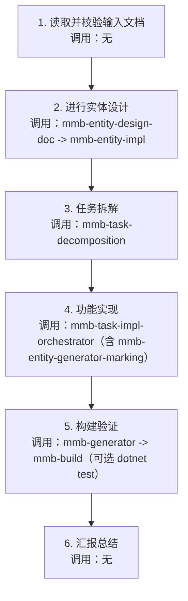

# MMB 开发生命周期编排

按“输入文档驱动”的统一流程执行任务：  
`读取并校验输入文档 -> 实体设计 -> 任务拆解 -> 功能实现 -> 构建验证 -> 汇报总结`。  
以“检索证据优先”推进，不基于记忆臆断框架细节。

## 前置输入（必须提供）
1. 功能设计文档：`{ModuleName}/docs/FunctionalDesign.md`（或模块内等效路径）
2. 需求分析文档：`RequirementsAnalysis.md`（通常位于仓库根或模块上级目录）

若路径不同，先在仓库内检索并在执行摘要中记录实际路径。

## 执行约束
1. 优先基于检索推理：先读取当前仓库文档、代码与已有技能，再决策。
2. 禁止修改任何 `MGC` 目录下文件。
3. 严格按 1 -> 6 串行执行，不并行跳步。
4. 步骤不适用时，必须记录“跳过原因”和“影响范围”。
5. 每步结束后记录产出文件与关键决策。
6. 控制器鉴权遵循项目默认策略，不添加无必要裸 `[Authorize]`。

## 增量执行模式（默认）
1. 默认按“校验 + 补差”执行，不按“全量重建”执行。
2. 若已存在实体设计、任务文档、完成报告，先复用并增量更新。
3. 仅在文档缺失、结构失效或用户明确要求重建时，执行重建。
4. 触发重建时必须记录触发原因、影响范围和回滚方式。

## 步骤与技能调用清单

### 步骤 1：读取并校验输入文档
目标：确认输入文档完整、可读、与目标任务一致，并完成现状盘点。

技能调用：
1. 无强制子技能（由当前技能直接完成检索与校验）。

检查点：
1. 是否成功读取功能设计文档与需求分析文档（按实际路径）。
2. 功能范围、模块范围、验收标准是否可提取。
3. 缺失文档时是否直接中止并报告缺失项。
4. 是否完成现状盘点：
   - 已实现功能清单
   - 已存在任务文档/完成报告
   - 未完成项与阻塞项
5. 是否输出“增量执行基线”（本轮新增/修改/复用候选）。

### 步骤 2：进行实体设计
目标：将功能设计映射到实体、枚举、字段、关系与生成策略。  
建议产出：`{ModuleName}/docs/EntityDesign.md`（或模块内等效路径）。

技能调用（按顺序）：
1. `mmb-entity-design-doc`：从功能设计文档生成/完善实体设计文档。
2. `mmb-entity-impl`：按实体设计实现实体与枚举（不改 `MGC`）。

检查点：
1. 实体字段、关系、索引、树形/位序能力是否与设计一致。
2. 不在本步骤执行实体标记；标记时机下沉到步骤 4 由 `mmb-task-impl-orchestrator` 按任务文档决策。
3. 若已存在实体设计文档或实体实现，默认执行差异校验并补差，不重建全量内容。
4. 若判定需要重建，必须记录重建原因和影响文件。

### 步骤 3：任务拆解
目标：把实体与功能设计拆为可执行任务，明确先后关系。  
建议产出：`{ModuleName}/docs/Tasks/{需求名}.md`。

技能调用：
1. `mmb-task-decomposition`：生成任务拆解文档，显式区分标准 CRUD 与非标准业务任务。

检查点：
1. 每个任务是否有清晰输入、输出、完成标准。
2. 是否明确跨任务依赖与执行顺序。
3. 若已存在任务文档，默认增量更新并保留历史任务，不重复创建同名任务。
4. 若任务文档需重建，必须记录重建原因和与旧版本差异。

### 步骤 4：功能实现
目标：按任务文档完成服务与控制器实现，并输出实施报告。

技能调用：
1. `mmb-task-impl-orchestrator`：统一执行实体标记、服务实现、控制器实现与实施汇报。

检查点：
1. 是否保持串行执行，且记录跳过原因/影响范围。
2. 是否产出 `{ModuleName}/docs/Tasks/{任务文件名}完成报告{yyyyMMddHHmmss}.md`（或模块内等效路径）。
3. `mmb-entity-generator-marking` 是否在本步骤内由 orchestrator 执行，且与任务边界一致。

### 步骤 5：构建验证
目标：确保代码生成、构建与基础质量验证可通过。

技能调用（按顺序）：
1. `mmb-generator`：执行代码生成，确保生成代码与实体标记一致。
2. `mmb-build`：构建对应模块解决方案（优先 `.slnx`，回退 `.sln`）。

可选验证：
1. 若存在测试项目，执行 `dotnet test` 并记录结果。

检查点：
1. 构建是否成功，警告/错误是否记录。
2. 若失败，是否定位到具体模块和文件。

### 步骤 6：汇报总结
目标：输出全流程总结，衔接“实现报告”和“构建验证结果”。
建议产出：`{ModuleName}/docs/Tasks/{需求名}全流程总结{yyyyMMddHHmmss}.md`。

技能调用：
1. 无强制子技能（由当前技能直接汇总）。

汇报内容模板：
1. 输入文档摘要：需求文档、功能设计、实体设计、任务文档来源。
2. 执行摘要：1-6 每步完成/跳过状态与原因。
3. 变更清单：文件路径与关键改动点。
4. 验证结果：代码生成、构建、测试结果。
5. 变更统计：新增/修改/复用 的文件数与任务数。
6. 风险与待办：阻塞项、依赖项、下一步建议。

## 跳过判定模板
任一步骤判定“跳过”时，按以下格式记录：
1. 跳过步骤：`步骤 X`
2. 跳过原因：`已存在且通过校验 / 不在本次范围 / 上游输入缺失 / 其他`
3. 证据：`文件路径或检索结果`
4. 影响范围：`对后续步骤、交付物、风险的影响`
5. 后续动作：`继续执行 / 等待补充 / 终止流程`

## 汇总执行顺序
1. 步骤 1：无子技能（读取并校验输入文档）
2. 步骤 2：`mmb-entity-design-doc` -> `mmb-entity-impl`
3. 步骤 3：`mmb-task-decomposition`
4. 步骤 4：`mmb-task-impl-orchestrator`（内部含 `mmb-entity-generator-marking`）
5. 步骤 5：`mmb-generator` -> `mmb-build`（可选 `dotnet test`）
6. 步骤 6：无子技能（全流程总结）

## 流程图

## 质量检查清单
- 是否完整执行 1 -> 6。
- 是否校验并记录输入文档实际路径。
- 是否在步骤 1 完成现状盘点与增量执行基线。
- 是否坚持检索证据优先。
- 是否保持 `MGC` 目录零改动。
- 是否在每步给出产出文件与关键决策。
- 是否在步骤 2/3 执行“默认补差、按需重建”。
- 是否记录每个跳过步骤的原因、证据和影响范围。
- 是否把“实现报告”和“全流程总结”分层输出，避免重复。
- 是否在汇报中给出新增/修改/复用统计。
