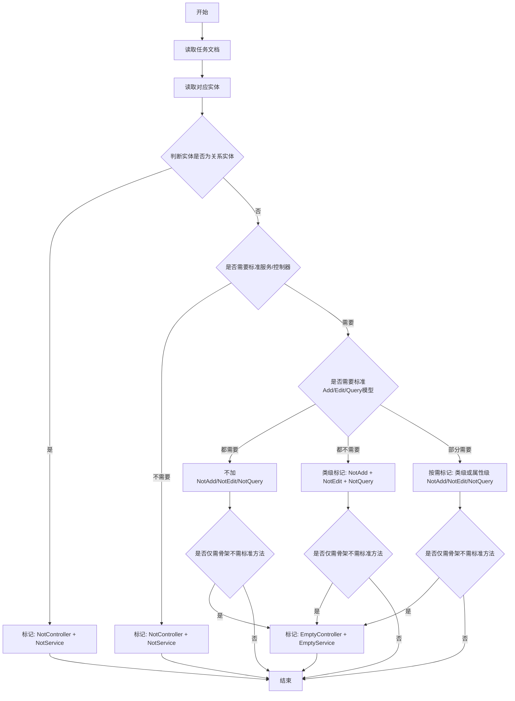

# MMB 实体生成标记

## Overview
根据任务文档和实体职责，为实体配置生成控制特性，避免生成器产出不需要的代码。
本技能面向全部实体，不局限于 CRUD 任务。

## 核心规则
先校验特性名称再执行：

- `NotAdd`、`NotEdit`、`NotQuery` 既可标记属性，也可标记类。
- 禁止修改任何 `MGC/` 目录文件。

类级特性组合：

- 关系实体/中间表：`[NotController]` + `[NotService]`
- 需要服务/控制器骨架但不生成标准方法：`[EmptyController]` + `[EmptyService]`
- 完整标准实体：不添加上述四个类级特性

模型生成抑制特性：

- 需要整体抑制实体的添加/修改/查询模型时：给类标记 `[NotAdd]`、`[NotEdit]`、`[NotQuery]`
- 只抑制部分字段时：给对应属性标记 `[NotAdd]`、`[NotEdit]`、`[NotQuery]`

Tree/Index 生成抑制特性（类级）：

- Tree：`[NotTreeController]`、`[NotTreeService]`、`[NotTreeDTO]`、`[NotTreeRepository]`
- Index：`[NotIndexController]`、`[NotIndexService]`、`[NotIndexRepository]`

## 工作流

按以下顺序执行：

1. 读取任务文档或设计文档，识别实体的接口职责。
2. 读取对应实体类（`{Project}.{Module}.Abstractions/Domain/{Entity}.cs` 或同类 MMB 路径）。
3. 判断实体是否为关系实体（中间表/关联实体）。
4. 判断是否需要标准服务/控制器、是否需要 Add/Edit/Query 模型。
5. 根据判定结果应用特性组合并去重。
6. 判断 Tree/Index 相关接口是否需要手写控制器统一权限策略。
7. 保存后运行 `mmb-generator` 技能生成代码。
8. 验证生成结果是否符合预期（无多余代码、无漏生成代码）。

## 判定决策树



## 关系实体判定标准

满足任一即可判定为关系实体：

1. 任务文档或设计文档明确写了“关系实体/中间表/关联表”。
2. 实体命名语义为 `*Relation`、`*Mapping`、`*Link` 等关系型命名。
3. 字段主要由两个或多个外键组成，不承载独立业务属性。

不确定时先按“保守生成”处理：优先 `Empty*` 而不是 `Not*`，避免把后续需要的服务/控制器完全禁掉。

## 编辑规范

1. 在实体类声明前添加类级特性，保持现有注释与排序风格。
2. 当实体整体不需要 Add/Edit/Query 模型时，优先给类标记 `[NotAdd]` `[NotEdit]` `[NotQuery]`。
3. 仅部分字段不参与模型时，再对属性做细粒度标记。
4. 已存在互斥特性时做纠正：
- 关系实体使用 `Not*`，移除 `Empty*`。
- 需要空骨架时使用 `Empty*`，移除 `Not*`。
5. 不修改 MGC 目录。
6. 当 Tree/Index 接口需要统一使用手写控制器权限策略时，优先通过实体类标记抑制对应生成代码：
- 仅手写 Tree 控制器：标记 `[NotTreeController]`
- 仅手写 Index 控制器：标记 `[NotIndexController]`
- 连同服务一起手写时，再按需标记 `[NotTreeService]` 或 `[NotIndexService]`
7. 若仅需保留 Tree/Index 服务能力而替换控制器，不要误加 `NotTreeService` 或 `NotIndexService`。

## Tree/Index 控生成决策

1. 需要保留生成 Tree/Index 控制器：不加 `NotTreeController` / `NotIndexController`。
2. 需要对 Tree/Index 动作统一施加策略（例如统一 `Authorize(Policy=...)`）且生成器无法满足：加 `NotTreeController` / `NotIndexController`，改为手写控制器。
3. 需要完全禁用 Tree DTO 生成时，再加 `NotTreeDTO`。
4. 需要完全禁用 Tree 仓储扩展时，加 `NotTreeRepository`。
4. 需要完全禁用 Index 仓储扩展时，加 `NotIndexRepository`。

## 示例

```csharp
[NotAdd]
[NotEdit]
[NotQuery]
[EmptyController]
[EmptyService]
public partial class Image : BaseDomain
{
    [Required]
    [MaxLength(255)]
    public string FileName { get; set; } = string.Empty;
}
```

## 参考

特性语义与命名参考见：
- `references/mmb-attribute-matrix.md`
