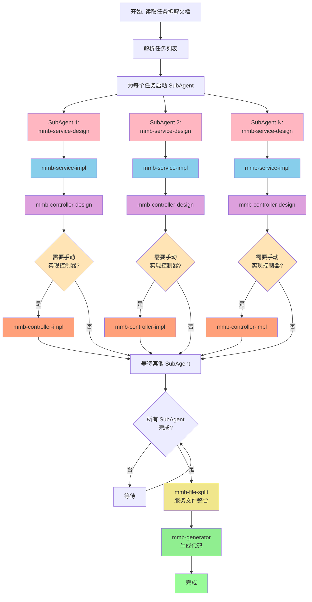

# MMB 业务实现技能

## 概述

本技能用于在任务拆解完成后，执行完整的业务实现流程，包括服务设计、服务实现、控制器设计、服务文件整合拆分和代码生成。

## 前置条件

业务实现应在**任务拆解完成后**进行。确保已完成：
- 需求分析文档（`docs/RequirementsAnalysis/` 目录）
- 功能设计文档（`docs/FeatureDesign/` 目录）
- 实体设计（`Abstractions/Domain/` 目录）
- 任务拆解文档（`docs/Tasks/` 目录）

## 工作流程



> **重要说明**：控制器实现（`mmb-controller-impl`）**仅在控制器无法通过 `[MapperController]` 自动生成时**才需要执行。大部分控制器可通过 `mmb-generator` 自动生成，无需手动实现。

## 执行步骤

### 第一步：读取并解析任务拆解文档

**读取任务文档**：
```bash
Read {ModuleName}/docs/Tasks/{TaskName}.md
```

**解析任务列表**：
- 提取所有任务编号（如 `T-Admin-01`、`T-Admin-02`）
- 提取每个任务的功能编号（如 `F-Admin-01`）
- 提取任务描述和验收标准
- 识别任务之间的依赖关系

**任务文档格式示例**：
```markdown
## T-Admin-01：管理员登录

**功能编号**：F-Admin-01
**任务描述**：实现管理员登录功能...
**参考**：功能设计文档 F-Admin-01
```

### 第二步：并行启动 SubAgent 执行业务实现

> **核心原则**：基于任务拆解文档中的任务，为每个任务启动独立的 SubAgent 进行服务设计、服务实现、控制器设计

#### 启动 SubAgent 的判断逻辑

**需要启动 SubAgent 的任务**：
- ✅ 任务描述中包含"实现"、"开发"等动词
- ✅ 任务有明确的功能编号（如 `F-Admin-01`）
- ✅ 任务需要新增或修改服务方法

**不需要启动 SubAgent 的任务**：
- ❌ 纯文档更新任务
- ❌ 配置调整任务
- ❌ 已完成的任务

#### SubAgent 并行执行

为所有需要实现的任务**同时**启动 SubAgent，最大化并行效率。

**SubAgent 执行流程**（每个任务独立执行）：

1. **服务设计阶段**（调用 `/mmb-service-design`）
   - 读取功能设计文档中对应的功能编号
   - 判断是否需要自定义服务接口
   - 设计服务接口、服务模型、DTO 等

2. **服务实现阶段**（调用 `/mmb-service-impl`）
   - 实现服务接口的业务逻辑
   - 如需仓储特殊方法，调用 `/mmb-repository-impl`

3. **控制器设计阶段**（调用 `/mmb-controller-design`）
   - 判断是否可通过 `[MapperController]` 自动生成
   - 如不能自动生成，设计控制器接口

4. **控制器实现阶段**（**条件执行**，调用 `/mmb-controller-impl`）
   - ⚠️ **仅当控制器无法通过 `[MapperController]` 自动生成时才执行**
   - 根据控制器接口实现控制器类

#### SubAgent 任务提示模板

```markdown
请为以下任务完成业务实现：

**任务编号**：{TaskID}
**功能编号**：{FeatureID}
**任务描述**：{TaskDescription}
**验收标准**：{AcceptanceCriteria}

请按以下流程执行：
1. 调用 `/mmb-service-design` 技能进行服务设计
2. 调用 `/mmb-service-impl` 技能进行服务实现
3. 调用 `/mmb-controller-design` 技能进行控制器设计
4. **条件执行**：如果控制器设计结果中显示需要手动实现控制器接口，则调用 `/mmb-controller-impl` 技能进行控制器实现；如果控制器可通过 `[MapperController]` 自动生成，则跳过此步骤

完成后返回实现结果摘要，包括：
- 服务设计结果（服务接口、自定义方法）
- 服务实现结果（实现类、实现方法）
- 控制器设计结果（自动生成/手动设计、API 端点）
- 控制器实现结果（如需要手动实现）
```

### 第三步：等待所有 SubAgent 完成

- 持续检查所有 SubAgent 的状态
- 确保所有任务都完成服务设计、服务实现、控制器设计
- 收集所有 SubAgent 的实现结果

### 第四步：服务文件整合拆分

> 当所有 SubAgent 完成后，调用 `/mmb-file-split` 技能进行服务接口、服务实现、控制器接口、控制器实现的整合与拆分

**执行内容**：
- 识别所有服务实现类文件（忽略 MGC 文件夹）
- 判断是否需要合并或拆分服务实现类
- 执行合并或拆分操作

**判断逻辑**：
- 如果只有一个简单的自定义文件（如 `.Custom.cs`），合并到主文件
- 如果有多个独立功能，按功能拆分文件

### 第五步：生成代码

> 调用 `/mmb-generator` 技能为所有修改的模块生成代码

**执行内容**：
- 识别所有发生变更的模块
- 为每个模块运行 `MMB GeneratorCode`
- 验证代码生成是否成功

## 输出格式

### SubAgent 实现结果摘要

每个 SubAgent 完成后应输出：

```markdown
## 任务实现摘要：{任务编号}

### 服务设计
- **服务接口**：`I{Entity}Service`
- **自定义方法**：{方法列表}

### 服务实现
- **实现类**：`{Entity}ServiceImpl.Custom.cs`
- **实现方法**：{方法列表}

### 控制器设计
- **控制器类型**：自动生成 / 手动设计
- **API 端点**：{端点列表}
- **需要手动实现**：是 / 否

### 控制器实现（如需要）
- **实现类**：`{Entity}Controller.cs`
- **实现方法**：{方法列表}
```

### 最终实现汇总

所有任务完成后输出：

```markdown
## 业务实现完成汇总

### 实现任务统计
- **总任务数**：{数量}
- **已完成任务**：{数量}
- **失败任务**：{数量}（如有）

### 涉及的模块
- {ModuleName}

### 服务实现汇总
| 服务 | 方法数 | 文件路径 |
|------|--------|----------|
| `I{Entity}Service` | {数量} | `{路径}` |

### 控制器汇总
| 控制器 | 端点数 | 生成方式 | 需手动实现 |
|--------|--------|----------|-----------|
| `{Controller}Controller` | {数量} | MapperController/手动设计 | 是/否 |

### 控制器实现汇总（仅手动设计的控制器）
| 控制器 | 实现方法数 | 文件路径 |
|--------|-----------|----------|
| `{Controller}Controller` | {数量} | `{路径}` |

> **说明**：标记为"MapperController"的控制器已通过 `/mmb-generator` 自动生成，无需手动实现。只有"手动设计"的控制器需要通过 `/mmb-controller-impl` 实现。

### 服务文件整合
- 合并的服务：{列表}
- 拆分的服务：{列表}

### 代码生成
- 生成成功的模块：{列表}
- 生成失败的模块：{列表}（如有）
```

## 相关技能

- **`/mmb-service-design`**：服务接口设计规范
- **`/mmb-service-impl`**：服务实现规范
- **`/mmb-controller-design`**：控制器设计规范
- **`/mmb-controller-impl`**：控制器实现规范（**仅当控制器无法自动生成时使用**）
- **`/mmb-file-split`**：服务文件整合拆分规范
- **`/mmb-generator`**：代码生成规范
- **`/mmb-repository-impl`**：仓储特殊方法实现规范

## 注意事项

1. **并行优先**：必须同时启动所有 SubAgent，最大化并行效率
2. **任务依赖**：如果任务有依赖关系，按依赖顺序启动 SubAgent
3. **禁止修改 MGC**：所有自定义代码必须在非 MGC 目录下
4. **完整性检查**：每个 SubAgent 必须完成服务设计、服务实现、控制器设计三个阶段
5. **控制器实现条件执行**：`/mmb-controller-impl` **仅当控制器无法通过 `[MapperController]` 自动生成时**才需要调用。大部分控制器可通过 `/mmb-generator` 自动生成，无需手动实现
6. **统一整合**：所有 SubAgent 完成后，统一进行服务文件整合和代码生成
7. **错误处理**：如果某个 SubAgent 失败，记录错误信息，继续执行其他任务
