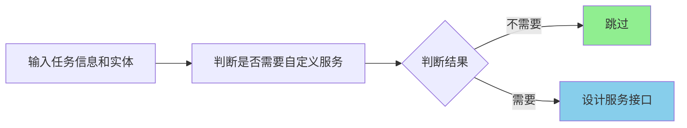
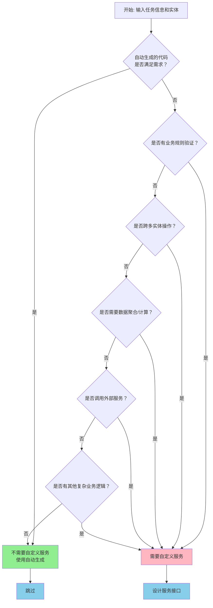

# MMB 服务接口设计技能

## 概述

本技能用于判断任务是否需要自定义服务接口，并在需要时设计符合 MMB 框架规范的服务接口。

**核心问题**：自动生成的代码是否满足当前任务需求？普通的CRUD，树形实体生成的交换父级，排序实体生成的交换位序等

> **重要说明**：本技能仅指导服务接口（Service Interface）的设计，**不涉及控制器接口（Controller Interface）的创建**。控制器接口设计请参考 MMB 框架的控制器相关技能。

## 工作流程



## 执行步骤

### 第一步：读取输入信息

**任务信息来源**：
- 任务拆解文档（`docs/Tasks/` 目录）
- 用户直接提供的任务描述

**实体信息来源**：
- 实体定义文件（`{ProjectName}.{ModuleName}.Abstractions/Domain/*.cs`）

```bash
# 读取任务拆解文档（如有）
Read docs/Tasks/{TaskName}.md

# 读取实体定义
Read {ProjectName}.{ModuleName}.Abstractions/Domain/{EntityName}.cs
```

### 第二步：判断是否需要自定义服务

#### 判断标准

**不需要自定义服务**（代码生成器自动生成的功能）：
- ✅ 普通实体的增删改查（CRUD）
- ✅ 树形实体的交换父级、获取树形结构等
- ✅ 排序实体的交换位序、调整排序等
- ✅ 基于实体属性的查询（Equal、Contains、Between 等）
- ✅ 基本的分页列表查询
- ✅ 单表或固定关系的查询

**需要自定义服务**（超出代码生成器能力）：
- ❌ 复杂业务规则验证（如库存扣减、额度计算）
- ❌ 跨多个实体的数据操作（如订单扣减库存）
- ❌ 复杂的数据聚合或计算（如报表统计）
- ❌ 需要调用外部服务或 API（如支付接口、短信发送）
- ❌ 复杂的动态查询（多条件组合、OR 查询等）
- ❌ 需要事务控制的跨表操作
- ❌ 状态机或工作流操作（如订单状态流转）
- ❌ 数据导入导出
- ❌ 缓存管理
- ❌ 消息发送或通知

#### 判断流程图



**流程说明**：
- `Z` 节点（绿色）：不需要自定义服务，直接使用代码生成器生成的功能
- `Y` 节点（粉色）：需要自定义服务，进入服务接口设计流程
- 判断优先级：按业务规则验证 → 跨实体操作 → 数据聚合/计算 → 外部服务调用 → 其他复杂逻辑

### 第三步：设计服务接口

**如果不需要自定义服务**：
- 输出判断结果，结束流程
- 提示可使用自动生成的标准服务

**如果需要自定义服务**：继续以下步骤

#### 3.1 确定服务命名

```
I{Entity}Service
```

示例：`IUserService`、`IOrderService`

#### 3.2 设计服务方法

**方法命名规范**：
- 查询：`GetInfoBy{Condition}Async`、`QueryBy{Condition}Async`、`{Action}Async`
- 操作：`{Verb}Async`（如 `CreateAsync`、`PaymentAsync`）
- 验证：`Validate{Condition}Async`、`Check{Condition}Async`

**方法签名模板**：

```csharp
/// <summary>
/// {方法描述}
/// </summary>
/// <param name="{ParameterName}">{参数描述}</param>
Task<{ReturnType}> {MethodName}Async({Parameters});

/// <summary>
/// {方法描述}
/// </summary>
/// <param name="{ParameterName}">{参数描述}</param>
{ReturnType} {MethodName}({Parameters});
```

**返回类型选择**：

**优先级原则**：尽可能返回 DTO 对象，简单类型满足时也可返回简单类型，无返回时则不返回

| 场景 | 异步方法返回类型 | 同步方法返回类型 |
|------|-----------------|-----------------|
| 无返回数据 | `Task` | `void` |
| 返回单个 DTO | `Task<{EntityDTO}>` | `{EntityDTO}` |
| 返回一组 DTO（非分页） | `Task<List<{EntityListDTO}>>` | `List<{EntityListDTO}>` |
| 返回分页列表 | `Task<(List<{EntityListDTO}> data, RangeModel rangeInfo)>` | `(List<{EntityListDTO}> data, RangeModel rangeInfo)` |
| 返回简单类型（满足需求时） | `Task<{Type}>` | `{Type}` |
| 流式响应 | `IAsyncEnumerable<{DTO}>` | 不支持 |

#### 3.3 判断是否需要自定义服务模型

**需要自定义服务模型的情况**：
- 请求参数与现有模型不一致
- 需要组合多个实体的输入
- 需要特殊的验证规则

**服务模型命名**：
- 查询模型：`Query{Entity}Model` 或 `{Action}Model`
- 操作模型：`{Action}{Entity}Model`

**服务模型位置**：
```
{ProjectName}.{ModuleName}.Abstractions/Services/Models/{Entity}/{ModelName}.cs
```

**服务模型模板**：

```csharp
namespace {ProjectName}.{ModuleName}.Abstractions.Services.Models.{Entity};

/// <summary>
/// {模型描述}
/// </summary>
public class {ModelName} [: FilterModel, PageRequestModel]
{
    /// <summary>
    /// {属性描述}
    /// </summary>
    [Required]
    [Equal]
    public string {PropertyName} { get; set; }

    // 其他属性...
}
```

**基类选择说明**：

| 基类 | 功能 | 使用场景 |
|------|------|---------|
| `FilterModel` | 排序、筛选 | 需要动态查询条件、排序功能 |
| `PageRequestModel` | 分页 | 需要分页查询（自动添加 PageIndex、PageSize） |
| 无基类 | 基础模型 | 简单的参数传递 |

**FilterModel 功能**：
- 属性：`SortPropertyName`（排序属性）、`IsAsc`（是否正序）
- 方法：
  - `GetSearchExpression<T>()` - 获取查询表达式树，可直接传递给仓储
  - `GetSortExpression<T>()` - 获取排序表达式树
  - `SetSortExpression<T>()` - 自动应用到 IQueryable

**PageRequestModel 功能**：
- 继承自 `RangeRequestModel`
- 属性：`PageIndex`（页码）、`PageSize`（每页数量）
- 自动计算：`PageSkip`（跳过数量）、`Skip`、`Take`

**使用示例**：

```csharp
// 查询模型 - 继承 FilterModel
public class QueryUserModel : FilterModel
{
    [Equal]
    public string? Name { get; set; }

    [Contains]
    public string? Email { get; set; }
}
// 在服务中直接使用
List<User> users = await _userRepository.FindAsync(requestModel);

// 在服务中直接使用表达式树
Expression<Func<User, bool>> searchExpression = requestModel.GetSearchExpression<User>();
searchExpression = searchExpression.And(m => m.IsEnabled == true);
List<User> users = await _userRepository.FindAsync(searchExpression, requestModel);

// 在服务中直接使用表达式树与排序
Expression<Func<User, bool>> searchExpression = requestModel.GetSearchExpression<User>();
searchExpression = searchExpression.And(m => m.IsEnabled == true);
Expression<Func<User, object>> sortExpression = requestModel.GetSortExpression<User>();
List<User> users = await _userRepository.FindAsync(searchExpression, sortExpression, SortOrder.Descending);

// 分页查询模型 - 继承 PageRequestModel
public class QueryUserPageModel : PageRequestModel
{
    [Equal]
    public string? Name { get; set; }

    [Contains]
    public string? Email { get; set; }
}

// 在服务中使用分页模型
QueryUserPageModel pageModel = new { PageIndex = 1, PageSize = 20 };
(long count, List<User> users) = await _repository.PagingAsync(pageModel);
```

#### 3.4 判断是否需要自定义 DTO

**需要自定义 DTO 的情况**：
- 返回数据与实体不一致
- 需要组合多个实体的数据
- 需要排除敏感字段

**DTO 命名**：
- 详情 DTO：`{Entity}DTO` 或 `{Entity}InfoDTO`
- 列表 DTO：`{Entity}ListDTO`
- 操作结果 DTO：`{Action}ResultDTO`

**DTO 位置**：
```
{ProjectName}.{ModuleName}.Abstractions/DTO/{Entity}/{DTOName}.cs
```

**DTO 模板**：

```csharp
namespace {ProjectName}.{ModuleName}.Abstractions.DTO.{Entity};

/// <summary>
/// {DTO描述}
/// </summary>
public class {DTOName}
{
    /// <summary>
    /// {属性描述}
    /// </summary>
    public {Type} {PropertyName} { get; set; }

    // 其他属性...
}
```

### 第四步：生成服务接口代码

#### 4.1 确定服务接口文件路径

```
{ProjectName}.{ModuleName}.Abstractions/Services/I{Entity}Service.cs
```

**注意**：如果服务接口已存在，则读取现有文件并在其中添加新方法

#### 4.2 生成服务接口代码

```csharp
namespace {ProjectName}.{ModuleName}.Abstractions.Services;

using {ProjectName}.{ModuleName}.Abstractions.Domain;
using {ProjectName}.{ModuleName}.Abstractions.DTO.{Entity};
using {ProjectName}.{ModuleName}.Abstractions.Services.Models.{Entity};

/// <summary>
/// {实体描述}服务
/// </summary>
public partial interface I{Entity}Service [: IBaseService]
{
    /// <summary>
    /// {方法描述}
    /// </summary>
    Task<{ReturnType}> {MethodName}Async({Parameters});

    // 其他自定义方法...
}
```

**接口继承说明**：

| 场景 | 继承接口 | 说明 |
|------|---------|------|
| 实体已自动生成 CRUD | 不需要继承 | 代码生成器已生成 `I{Entity}Service`，直接在 partial interface 中添加方法 |
| 实体标记 `[NotService]` | `: IBaseService` | 禁止自动生成服务，需手动定义接口（只能访问 LoginUserID） |
| 与实体无关的服务 | `: IBaseService` | 如工具类服务、计算服务等 |
| 完整自定义 CRUD 服务 | `: IBaseService<TAddModel, TEditModel, TQueryModel, TDTO, TListDTO>` | 需要 5 个泛型参数，完整 CRUD 功能 |


**示例**：

```csharp
// 场景1: 实体已自动生成 CRUD - 不需要继承
public partial interface IUserService
{
    // 直接添加自定义方法
    Task<UserDTO> GetByPhoneNumberAsync(string phone);
}

// 场景2: 实体标记 [NotService] 或与实体无关的服务
public interface ICalculateService : IBaseService
{
    // 只能访问 LoginUserID 属性
    Task<decimal> CalculateInterestAsync(CalculateInterestModel model);
}

// 场景3: 完整自定义 CRUD 服务（不推荐，优先使用代码生成）
public interface ICustomOrderService : IBaseService<AddOrderModel, EditOrderModel, QueryOrderModel, OrderDTO, OrderListDTO>
{
    // 继承完整的 CRUD 方法：AddAsync, EditAsync, DeleteAsync, GetInfoAsync, GetListAsync
    // 可添加额外自定义方法
    Task<OrderDTO> GetByOrderNoAsync(string orderNo);
}
```

#### 4.3 写入文件

```bash
# 服务接口不存在时创建新文件
Write {ProjectName}.{ModuleName}.Abstractions/Services/I{Entity}Service.cs

# 服务接口已存在时，使用 Edit 添加新方法
Edit {ProjectName}.{ModuleName}.Abstractions/Services/I{Entity}Service.cs
```

### 第五步：生成辅助代码

#### 5.1 生成服务模型（如需要）

```bash
Write {ProjectName}.{ModuleName}.Abstractions/Services/Models/{Entity}/{ModelName}.cs
```

#### 5.2 生成 DTO（如需要）

```bash
Write {ProjectName}.{ModuleName}.Abstractions/DTO/{Entity}/{DTOName}.cs
```

### 第六步：汇总设计结果

输出服务接口设计摘要：

```markdown
## 服务接口设计摘要

### 判断结果
{需要/不需要}自定义服务接口

### 服务接口
- **接口名称**：`I{Entity}Service`
- **文件路径**：`{ProjectName}.{ModuleName}.Abstractions/Services/I{Entity}Service.cs`
- **继承关系**：`IBaseService<...>`

### 自定义方法

| 方法名 | 返回类型 | 描述 |
|--------|---------|------|
| `{MethodName}Async` | `Task<{ReturnType}>` | {描述} |

### 服务模型（如有）

| 模型名 | 路径 | 用途 |
|--------|------|------|
| `{ModelName}` | `Services/Models/{Entity}/...` | {用途} |

### DTO（如有）

| DTO名 | 路径 | 用途 |
|-------|------|------|
| `{DTOName}` | `DTO/{Entity}/...` | {用途} |

### 下一步
1. 运行 `/mmb-generator` 生成代码
2. 实现服务逻辑
```

### 相关技能

- **`/mmb-entity-design`**：实体设计规范
- **`/mmb-exception-handling`**：异常处理规范

## 常见场景示例

### 场景1：用户注册（需要自定义服务）

**判断**：需要密码加密、用户名唯一性验证、创建默认角色关联 → 需要自定义服务

```csharp
/// <summary>
/// 用户注册
/// </summary>
[MapperController(MapperType.Post)]
Task<UserDTO> RegisterAsync(RegisterModel model);
```

### 场景2：获取用户列表（不需要自定义服务）

**判断**：标准 CRUD 查询 → 不需要自定义服务

使用自动生成的 `QueryUserModel` 即可

### 场景3：订单结算（需要自定义服务）

**判断**：涉及库存扣减、支付接口调用、订单状态更新 → 需要自定义服务

```csharp
/// <summary>
/// 订单结算
/// </summary>
[MapperController(MapperType.Post)]
Task<OrderDTO> CheckoutAsync(CheckoutModel model);
```

### 场景4：批量删除（需要自定义服务）

**判断**：需要事务控制多个实体的删除操作 → 需要自定义服务

```csharp
/// <summary>
/// 批量删除
/// </summary>
[MapperController(MapperType.Post)]
Task BatchDeleteAsync(BatchDeleteModel model);
```

## 注意事项

1. **优先使用自动生成**：能使用标准 CRUD 的场景不要自定义服务
2. **命名一致性**：服务、模型、DTO 的命名应保持一致
3. **XML 注释**：所有方法和参数必须包含 XML 注释
4. **异步方法**：所有服务方法必须是异步的（`Task` 或 `Task<T>`）
