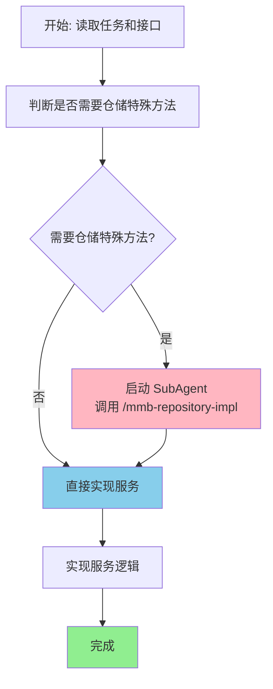
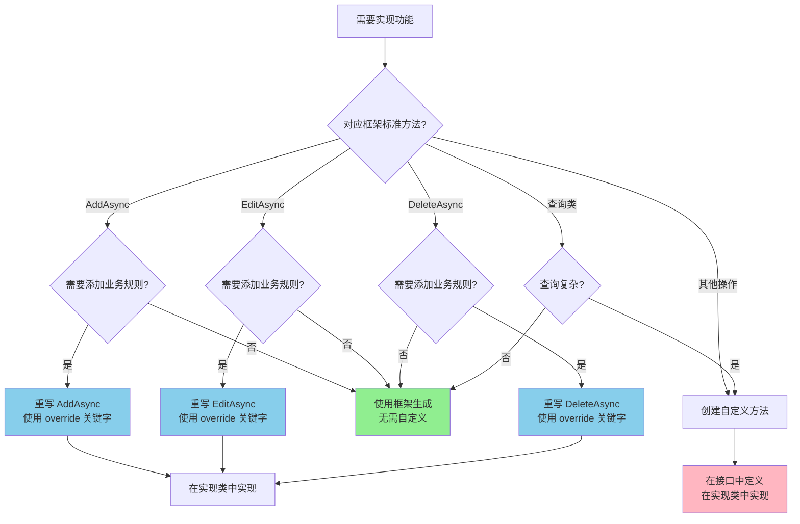

# MMB 服务实现技能

## 概述

本技能用于在服务接口设计完成后，实现服务类的业务逻辑。

## 输入

- 任务文档路径（`docs/Tasks/` 目录下的任务拆解文档）
- 服务接口代码文件路径

## 工作流程



## 执行步骤

### 第一步：读取输入信息

**读取任务文档**：
```bash
Read docs/Tasks/{TaskName}.md
```

**读取服务接口代码**：
```bash
Read {ProjectName}.{ModuleName}.Abstractions/Services/I{Entity}Service.cs
```

**读取实体定义**：
```bash
Read {ProjectName}.{ModuleName}.Abstractions/Domain/{EntityName}.cs
```

### 第二步：判断是否需要仓储提供特殊方法

> 详细的判断标准和示例参考 [仓储方法判断指南](references/repository-impl-guide.md)

#### 判断依据（主要考虑性能）

**不需要仓储特殊方法**（使用默认仓储方法）：
- ✅ 单实体 CRUD 操作（`AddAsync`、`EditAsync`、`DeleteAsync`）
- ✅ 按 ID 查询（`FirstOrDefaultAsync`）
- ✅ 简单条件查询（使用 `FilterModel` 的特性查询）
- ✅ 基本分页查询（`PagingAsync`）
- ✅ 存在性检查（`ExistedAsync`）
- ✅ 数量统计（`CountAsync`）

**需要仓储特殊方法**（性能优化或复杂查询）：
- ❌ **N+1 查询问题**：需要一次性加载关联数据避免多次查询
  - 示例：查询订单列表时需要同时加载用户信息和商品详情
  - 解决：仓储提供 `GetOrdersWithDetailsAsync` 方法，使用 `Include` 预加载
- ❌ **批量操作优化**：大量数据操作需要批量处理
  - 示例：批量更新用户状态、批量插入数据
  - 解决：仓储提供 `BatchUpdateAsync`、`BatchInsertAsync` 方法
- ❌ **复杂聚合查询**：需要分组、统计等复杂 SQL
  - 示例：统计各分类的商品数量、计算用户的订单总金额
  - 解决：仓储提供 `GetCategoryStatisticsAsync`、`GetUserTotalAmountAsync` 方法
- ❌ **原生 SQL 查询**：EF Core 生成的 SQL 性能不佳
  - 示例：复杂的多表 JOIN、子查询、全文搜索
  - 解决：仓储提供 `SearchByFullTextAsync` 方法，使用 `FromSqlRaw`
- ❌ **存储过程调用**：业务逻辑已封装在存储过程中
  - 示例：复杂的报表查询、数据迁移
  - 解决：仓储提供对应方法调用存储过程
- ❌ **特定数据库特性**：需要使用数据库特定功能
  - 示例：SQL Server 的 `TABLESAMPLE`、PostgreSQL 的 JSON 查询
  - 解决：仓储提供相应方法

#### N+1 查询示例

```csharp
// ❌ 不需要仓储方法：简单查询
List<Order> orders = await _orderRepository.FindAsync(o => o.UserID == userID);

// ✅ 需要仓储方法：避免 N+1
// 场景：查询订单同时需要用户信息和商品详情
// 方案：仓储提供带 Include 的方法
public class OrderRepositoryImpl : IOrderRepository
{
    public async Task<List<Order>> GetOrdersWithDetailsAsync(Expression<Func<Order, bool>> where)
    {
        return await DbSet
            .Include(o => o.User)
            .Include(o => o.Items)
                .ThenInclude(i => i.Product)
            .Where(where)
            .ToListAsync();
    }
}
```

#### 复杂聚合查询示例

```csharp
// ❌ 不需要仓储方法：简单统计
long count = await _userRepository.CountAsync(u => u.IsEnabled);

// ✅ 需要仓储方法：复杂聚合
// 场景：统计各分类的商品数量和平均价格
// 方案：仓储提供专门的统计方法
public async Task<List<CategoryStatisticsDTO>> GetCategoryStatisticsAsync()
{
    return await DbSet
        .GroupBy(p => p.CategoryID)
        .Select(g => new CategoryStatisticsDTO
        {
            CategoryID = g.Key,
            ProductCount = g.Count(),
            AveragePrice = g.Average(p => p.Price)
        })
        .ToListAsync();
}
```

### 第三步：处理仓储特殊方法（如需要）

**如果需要仓储提供特殊方法**：启动 SubAgent 实现仓储

```bash
TaskCreate "仓储实现" "为 {Entity} 实现仓储特殊方法，优化查询性能" "activeForm: 实现仓储方法"
```

SubAgent 执行流程：
1. 调用 `/mmb-repository-impl` 技能
2. 设计仓储接口方法
3. 实现仓储方法
4. 返回实现结果

### 第四步：实现服务逻辑

#### 4.1 ⚠️ 确定（正确的）服务实现文件路径

> **禁止修改 MGC 文件夹下的任何文件！**
>
> MGC 文件夹中的文件是自动生成的，每次代码生成都会被重建。任何对 MGC 文件的修改都会在下次生成时丢失。

**正确做法**：使用 Partial Class 扩展

```
ZhiTu.{ModuleName}.Application/
├── Services/
│   ├── {Entity}ServiceImpl.Custom.cs    ← 自定义服务实现（手动创建）✅
├── MGC/
│   └── Services/
│       └── {Entity}ServiceImpl.cs       ← 自动生成（禁止修改）❌
```

**服务实现文件路径**：
```
{ProjectName}.{ModuleName}.Application/Services/{Entity}ServiceImpl.Custom.cs
```

#### 4.2 服务实现模板

```csharp
namespace {ProjectName}.{ModuleName}.Application.Services;

using Materal.MergeBlock.Authorization.Abstractions;  // 仅引用实际需要的命名空间
using {ProjectName}.Core.Abstractions;                // 项目根异常类
using {ProjectName}.Core.Application.Helpers;        // 项目工具类（如 PasswordHelper）
using {ProjectName}.{ModuleName}.Abstractions.Domain;
using {ProjectName}.{ModuleName}.Abstractions.DTO;
using {ProjectName}.{ModuleName}.Abstractions.Services.Models;

/// <summary>
/// {实体描述}服务自定义实现
/// </summary>
public partial class {Entity}ServiceImpl
{
    private readonly I{OtherService}Service _{otherService};  // 如需注入其他服务

    /// <summary>
    /// 服务实现构造函数（注入依赖）
    /// </summary>
    public {Entity}ServiceImpl(I{OtherService}Service otherService)
    {
        _{otherService} = otherService;
    }

    public async Task<{ReturnType}> {MethodName}Async({Parameters})
    {
        // 1. 参数验证
        if (string.IsNullOrWhiteSpace(model.{PropertyName})) throw new {ProjectName}Exception("{属性}不能为空");

        // 2. 业务规则验证
        if (await DefaultRepository.ExistedAsync(m => m.{Property} == model.{Property})) throw new {ProjectName}Exception("{业务规则错误描述}");

        // 3. 执行业务逻辑
        {Entity} entity = Mapper.Map<{Entity}>(model);

        UnitOfWork.RegisterAdd(entity);      // ⚠️ RegisterAdd 是同步方法，不要用 await
        await UnitOfWork.CommitAsync();

        // 4. 返回结果
        return Mapper.Map<{ReturnType}>(entity);
    }
}
```

#### 4.3 BaseServiceImpl 提供的属性

> MMB 框架的 `BaseServiceImpl` 基类根据泛型参数不同，提供以下可用属性：

| 属性名 | 类型 | 提供条件 | 说明 |
|--------|------|----------|------|
| `LoginUserID` | `Guid` | 所有版本 | 登录用户唯一标识，从 HTTP 上下文获取 |
| `Mapper` | `IMapper` | 所有版本 | 对象映射器，用于 DTO 与实体转换 |
| `UnitOfWork` | `TUnitOfWork` | 带有 `TUnitOfWork` 泛型参数 | 工作单元，管理数据库事务 |
| `DefaultRepository` | `TRepository` | 带有 `TRepository` 泛型参数 | 主实体仓储，用于数据库操作 |
| `DefaultViewRepository` | `TViewRepository` | 带有 `TViewRepository` 泛型参数 | 视图实体仓储，用于查询视图数据 |

**基类选择说明**：

```csharp
// 1. 最简单版本（无仓储）
public class MyServiceImpl : BaseServiceImpl
{
    // 可用属性: LoginUserID, Mapper
}

// 2. 带工作单元版本
public class MyServiceImpl : BaseServiceImpl<IMainUnitOfWork>
{
    // 可用属性: LoginUserID, Mapper, UnitOfWork
}

// 3. 带仓储版本（最常用）
public class UserServiceImpl : BaseServiceImpl<IUserRepository, User, IMainUnitOfWork>
{
    // 可用属性: LoginUserID, Mapper, UnitOfWork, DefaultRepository
}

// 4. 带视图仓储版本
public class UserServiceImpl : BaseServiceImpl<IUserRepository, IUserViewRepository, User, UserViewDomain, IMainUnitOfWork>
{
    // 可用属性: LoginUserID, Mapper, UnitOfWork, DefaultRepository, DefaultViewRepository
}
```

#### 4.4 其他仓储注入规范

| 仓储类型 | 注入参数命名 | 说明 |
|---------|-------------|------|
| 非主实体仓储 | `_{entity}Repository` | 使用小写实体名，需通过构造函数注入 |

**示例**：

```csharp
public partial class OrderServiceImpl
{
    // DefaultRepository 由 BaseServiceImpl 提供 (IOrderRepository)
    // 其他仓储需手动注入
    private readonly IUserRepository _userRepository;
    private readonly IProductRepository _productRepository;

    public OrderServiceImpl(
        IUserRepository userRepository,
        IProductRepository productRepository)
    {
        _userRepository = userRepository;
        _productRepository = productRepository;
    }

    public async Task<OrderWithUserInfoDTO> GetOrderAsync(Guid id)
    {
        // 使用 DefaultRepository（自动提供）
        Order order = await DefaultRepository.FirstOrDefaultAsync(id);

        // 使用其他仓储（手动注入）
        User user = await _userRepository.FirstOrDefaultAsync(order.UserID);

        return Mapper.Map<OrderWithUserInfoDTO>((order, user));
    }
}
```

#### 4.5 仓储默认方法参考

> MMB 框架仓储基类提供了丰富的默认方法，大多数场景下无需自定义仓储方法。
>
> 📖 **详细方法列表**：请参阅 [仓储方法参考文档](references/repository-methods.md)

**常用方法速查**：

| 需求 | 推荐方法 |
|------|----------|
| 检查数据是否存在 | `await DefaultRepository.ExistedAsync(id)` |
| 统计数量 | `await DefaultRepository.CountAsync(expression)` |
| 查询单条数据 | `await DefaultRepository.FirstOrDefaultAsync(id)` |
| 查询列表 | `await DefaultRepository.FindAsync(expression)` |
| 分页查询 | `await DefaultRepository.PagingAsync(pageRequestModel)` |
| 范围查询 | `await DefaultRepository.RangeAsync(...)` |

#### 4.6 实现要点

**参数验证**：
```csharp
// 使用项目根异常类
if (string.IsNullOrWhiteSpace(model.UserName)) throw new ZhiTuException("用户名不能为空");

if (model.Password.Length < 6) throw new ZhiTuException("密码长度不能少于6位");
```

**业务规则检查**：
```csharp
// 检查数据是否存在
User user = await DefaultRepository.FirstOrDefaultAsync(id) ?? throw new ZhiTuException($"用户不存在：{id}");

// 检查唯一性
if (await DefaultRepository.ExistedAsync(u => u.UserName == model.UserName)) throw new ZhiTuException("用户名已存在");

// 检查业务状态
if (order.Status != OrderStatus.Pending) throw new ZhiTuException("只有待支付订单才能取消");
```

**数据操作**：
```csharp
// 新增
User user = Mapper.Map<User>(model);
UnitOfWork.RegisterAdd(user);      // ⚠️ RegisterAdd 是同步方法，不要用 await
await UnitOfWork.CommitAsync();

// 修改
User user = await DefaultRepository.FirstOrDefaultAsync(id);
Mapper.Map(model, user);
UnitOfWork.RegisterEdit(user);      // ⚠️ RegisterEdit 是同步方法，不要用 await
await UnitOfWork.CommitAsync();

// 删除
User user = await DefaultRepository.FirstOrDefaultAsync(id);
UnitOfWork.RegisterDelete(user);    // ⚠️ RegisterDelete 是同步方法，不要用 await
await UnitOfWork.CommitAsync();

// 查询
User user = await DefaultRepository.FirstOrDefaultAsync(id);
List<User> users = await DefaultRepository.FindAsync(expression);
(long count, List<User> users) = await DefaultRepository.PagingAsync(pageModel);
```

**LoginUserID 安全使用**（`Guid` 类型，未登录时为 `Guid.Empty`）：
```csharp
// ❌ 错误写法：未登录时 LoginUserID 为 Guid.Empty，会导致查询错误
// Admin admin = await DefaultRepository.FirstOrDefaultAsync(LoginUserID);

// ✅ 正确写法：检查是否为 Guid.Empty
public async Task<UserDTO> GetLoginUserInfoAsync()
{
    // 1. 检查是否已登录
    if (LoginUserID == Guid.Empty)
    {
        throw new ZhiTuException("未登录");
    }

    // 2. 直接使用 LoginUserID
    User user = await DefaultRepository.FirstOrDefaultAsync(LoginUserID)
        ?? throw new ZhiTuException("用户不存在");

    return Mapper.Map<UserDTO>(user);
}

// ✅ 简化写法：直接检查并使用
public async Task ChangeOwnPasswordAsync(ChangePasswordModel model)
{
    if (LoginUserID == Guid.Empty)
    {
        throw new ZhiTuException("未登录");
    }
    User user = await DefaultRepository.FirstOrDefaultAsync(LoginUserID);
    // ...
}

// ✅ 比较操作：直接比较
if (LoginUserID == targetID)
{
    throw new ZhiTuException("不能对自己执行此操作");
}
```

**使用仓储特殊方法**（如果已实现）：
```csharp
// 使用带 Include 的方法避免 N+1
List<Order> orders = await DefaultRepository.GetOrdersWithDetailsAsync(o => o.UserID == userID);

// 使用批量操作
await DefaultRepository.BatchUpdateStatusAsync(userIDs, newStatus);

// 使用复杂聚合查询
List<CategoryStatisticsDTO> statistics = await DefaultRepository.GetCategoryStatisticsAsync();
```

**事务处理**：
```csharp
// 单操作
UnitOfWork.RegisterAdd(user);      // ⚠️ 同步方法，不要用 await
await UnitOfWork.CommitAsync();

// 多操作（自动事务）
UnitOfWork.RegisterAdd(order);     // ⚠️ 同步方法，不要用 await
UnitOfWork.RegisterAdd(orderLog);
foreach (var item in orderItems)
{
    UnitOfWork.RegisterAdd(item);   // ⚠️ 同步方法，不要用 await
}
await UnitOfWork.CommitAsync();
```

**[NotEdit] 特性保护的字段**：
```csharp
// 实体定义中使用了 [NotEdit] 特性
public class Admin
{
    [NotEdit]  // EditAdminModel 不会包含此字段，框架自动保护
    public string Account { get; set; }
}

// 重写 EditAsync 时无需手动处理 Account
public override async Task EditAsync(EditAdminModel model)
{
    Admin admin = await DefaultRepository.FirstOrDefaultAsync(model.ID);
    if (admin is null) throw new ZhiTuException("管理员不存在");

    // ✅ 可以修改的字段
    admin.Name = model.Name;
    admin.Remark = model.Remark;

    // Account 已被 [NotEdit] 保护，EditAdminModel 中不包含此字段
    // 无需手动处理，框架自动忽略

    UnitOfWork.RegisterEdit(admin);
    await UnitOfWork.CommitAsync();
}
```

**代码生成时机**：
```
修改实体属性/特性
    ↓
运行 /mmb-generator → 生成/更新 DTO、RequestModel、ServiceModel
    ↓
修改服务接口
    ↓
运行 /mmb-generator → 生成/更新控制器接口、服务实现基类
    ↓
修改服务实现
    ↓
运行 /mmb-generator → 同步代码
    ↓
构建验证
```

**每次修改以下内容后都需要运行 /mmb-generator**：
- 实体属性或特性（`Domain/*.cs`）
- 服务接口定义（`Services/I*Service.cs`）
- 控制器接口定义（`Controllers/I*Controller.cs`）
- 服务实现文件（需要在 MGC 中同步 partial class）

**返回映射**：
```csharp
// 单个对象
return Mapper.Map<UserDTO>(user);

// 列表
return Mapper.Map<List<UserListDTO>>(users);

// 分页
return (Mapper.Map<List<UserListDTO>>(users), new RangeModel(count, pageModel.PageIndex, pageModel.PageSize));
```

### 第五步：写入实现文件

> **重要**：始终在非 MGC 目录下创建/编辑文件

**创建新文件（推荐使用 .Custom.cs 后缀）**：
```bash
Write {ProjectName}.{ModuleName}.Application/Services/{Entity}ServiceImpl.Custom.cs
```

**在现有文件中添加方法**：
```bash
Edit {ProjectName}.{ModuleName}.Application/Services/{Entity}ServiceImpl.Custom.cs
```

## 输出

服务实现完成后输出实现摘要：

```markdown
## 服务实现摘要

### 服务
- **接口名称**：`I{Entity}Service`
- **实现类名**：`{Entity}ServiceImpl`（partial class 扩展）
- **文件路径**：`{ProjectName}.{ModuleName}.Application/Services/{Entity}ServiceImpl.Custom.cs` ✅

### 实现方法

| 方法名 | 返回类型 | 描述 |
|--------|---------|------|
| `{MethodName}Async` | `Task<{ReturnType}>` | {描述} |

### 仓储方法（如有）

| 方法名 | 用途 | 性能优化点 |
|--------|------|-----------|
| `{MethodName}Async` | {用途} | {优化描述} |
```

## 相关技能

- **`/mmb-service-design`**：服务接口设计规范
- **`/mmb-repository-impl`**：仓储特殊方法实现规范
- **`/mmb-exception-handling`**：异常处理规范

## 注意事项

1. **禁止修改 MGC 文件夹**：MGC 文件夹中的文件是自动生成的，每次代码生成都会被重建
2. **性能优先**：在实现前必须评估是否需要仓储特殊方法来优化性能
3. **异常处理**：统一使用项目根异常类（如 `ZhiTuException`）
4. **XML 注释**：实现类应包含 XML 注释
5. **依赖注入**：使用构造函数注入依赖
6. **映射使用**：优先使用 `Mapper` 进行对象映射
7. **UnitOfWork 方法**：`RegisterAdd`/`RegisterEdit`/`RegisterDelete` 是同步方法，不要使用 `await`

---

## 框架方法重写 vs 自定义方法决策

> **重要原则**：优先使用框架提供的标准 CRUD 方法，仅在需要添加业务规则时重写它们。

### 决策流程图



### 场景判断表

#### 需要重写框架方法的场景

| 方法 | 需要重写的场景 | 示例 |
|------|---------------|------|
| **AddAsync** | • 唯一性验证（账号、邮箱等）<br>• 密码加密处理<br>• 设置默认值<br>• 关联数据初始化 | 管理员账号唯一性检查、密码 SHA256 加密 |
| **EditAsync** | • 特定字段不允许修改（由 `[NotEdit]` 保护）<br>• 修改时需要更新关联数据<br>• 状态变更需要验证 | 修改管理员名称但不允许修改账号 |
| **DeleteAsync** | • 不能删除最后一条数据<br>• 不能删除当前登录用户<br>• 删除前需要清理关联数据 | 系统至少保留一个管理员、不能删除自己 |

#### 使用框架生成的场景

| 方法 | 使用框架生成的场景 |
|------|-------------------|
| **AddAsync** | • 无特殊业务规则<br>• 仅简单插入数据 |
| **EditAsync** | • 无特殊业务规则<br>• 敏感字段已用 `[NotEdit]` 保护 |
| **DeleteAsync** | • 无特殊业务规则<br>• 仅简单删除操作 |
| **GetInfoAsync** | • 按 ID 查询详情 |
| **GetListAsync** | • 基本分页列表查询 |
| **QueryUserModel** | • 使用 `[Equal]`、`[Contains]` 等特性的动态查询 |

### 返回类型规范

| 框架方法 | 返回类型 | 说明 |
|----------|---------|------|
| `AddAsync` | `Task<Guid>` | 返回新增实体的 ID |
| `EditAsync` | `Task` | 无返回值 |
| `DeleteAsync` | `Task` | 无返回值 |
| `GetInfoAsync` | `Task<{Entity}DTO>` | 返回详情 DTO |
| `GetListAsync` | `Task<(List<{Entity}ListDTO> data, RangeModel rangeInfo)>` | 返回分页列表 |

### 正确 vs 错误实现示例

#### ❌ 错误：创建自定义方法而非重写

```csharp
// 错误：创建了自定义方法 AddAdminAsync
public async Task<AdminDTO> AddAdminAsync(AddAdminRequestModelCustom model)
{
    // 业务逻辑...
}

// 错误：在接口中使用了 new 关键字
public partial interface IAdminService
{
    [MapperController(MapperType.Post)]
    new Task<Guid> AddAsync(AddAdminModel model);  // ❌ 不要在接口中使用 new
}
```

#### ✅ 正确：重写框架方法

```csharp
// 正确：重写框架的 AddAsync 方法
public override async Task<Guid> AddAsync(AddAdminModel model)
{
    // 1. 检查账号唯一性
    Admin? existingAdmin = await DefaultRepository.FirstOrDefaultAsync(m => m.Account == model.Account);
    if (existingAdmin is not null)
    {
        throw new ZhiTuException("账号已存在");
    }

    // 2. 密码加密
    string passwordHash = PasswordHelper.HashPassword(model.Password);

    // 3. 创建实体
    Admin admin = new Admin
    {
        Name = model.Name,
        Account = model.Account,
        Password = passwordHash,
        Remark = model.Remark,
        IsEnabled = true
    };

    // 4. 保存
    UnitOfWork.RegisterAdd(admin);
    await UnitOfWork.CommitAsync();

    return admin.ID;
}
```

### 关键要点

1. **重写不需要在接口中声明**：`override` 的方法是框架基类已定义的，不需要在服务接口中重复声明
2. **使用 `override` 关键字**：必须使用 `override` 而非 `new`
3. **保持返回类型一致**：重写方法的返回类型必须与框架定义一致（如 `AddAsync` 返回 `Task<Guid>`）
4. **调用基类方法**：如果需要在重写方法中调用基类实现，使用 `await base.AddAsync(model)`
