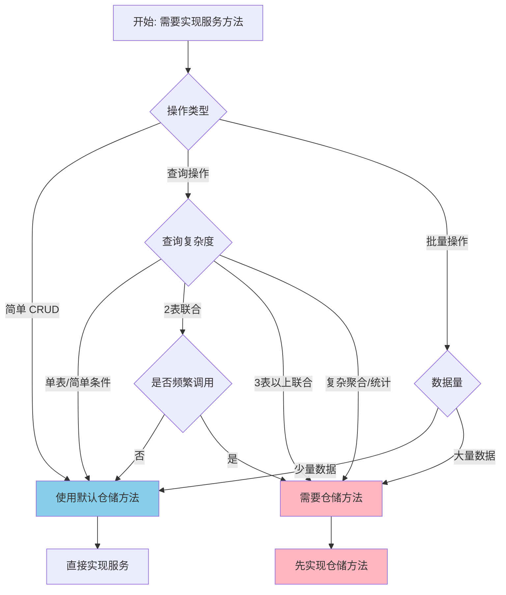

# 仓储方法判断指南

> 本指南用于判断在服务实现时是否需要为仓储提供特殊方法。主要考虑因素是性能优化和复杂查询处理。

## 概述

MMB 框架的仓储基类提供了丰富的基础方法（CRUD、分页、条件查询等），大多数场景下无需自定义仓储方法。只有当遇到性能问题或复杂查询时，才需要为仓储添加特殊方法。

## 快速决策树



## 不需要仓储特殊方法的场景

> 以下场景使用 MMB 仓储基类提供的默认方法即可。

### 1. 单实体 CRUD 操作

| 默认方法 | 说明 | 示例 |
|---------|------|------|
| `AddAsync` | 新增实体 | `await _unitOfWork.RegisterAdd(entity)` |
| `EditAsync` | 修改实体 | `await _unitOfWork.RegisterEdit(entity)` |
| `DeleteAsync` | 删除实体 | `await _unitOfWork.RegisterDelete(entity)` |

```csharp
// ✅ 服务层直接处理
public async Task AddUserAsync(AddUserModel model)
{
    User user = _mapper.Map<User>(model);
    await _unitOfWork.RegisterAdd(user);
    await _unitOfWork.CommitAsync();
}
```

### 2. 按 ID 查询

| 默认方法 | 说明 | 示例 |
|---------|------|------|
| `FirstOrDefaultAsync` | 按 ID 查询单个实体 | `await _repository.FirstOrDefaultAsync(id)` |

```csharp
// ✅ 使用默认方法
User user = await _userRepository.FirstOrDefaultAsync(userID)
    ?? throw new ZhiTuException($"用户不存在：{userID}");
```

### 3. 简单条件查询

| 默认方法 | 说明 | 示例 |
|---------|------|------|
| `FindAsync` | 按条件查询列表 | `await _repository.FindAsync(u => u.Status == UserStatus.Enabled)` |
| `ExistsAsync` | 检查是否存在 | `await _repository.ExistsAsync(u => u.UserName == name)` |
| `CountAsync` | 统计数量 | `await _repository.CountAsync(u => u.IsEnabled)` |

```csharp
// ✅ 使用默认方法
List<User> users = await _userRepository.FindAsync(u => u.Status == UserStatus.Enabled);
bool exists = await _userRepository.ExistsAsync(u => u.UserName == userName);
long count = await _userRepository.CountAsync(u => u.IsEnabled);
```

### 4. 基本分页查询

| 默认方法 | 说明 | 示例 |
|---------|------|------|
| `PagingAsync` | 分页查询 | `await _repository.PagingAsync(pageModel)` |

```csharp
// ✅ 使用默认方法 + FilterModel
public async Task<(List<UserListDTO>, RangeModel)> GetUserListAsync(QueryUserModel model)
{
    PagingModel<User> pageModel = _mapper.Map<PagingModel<User>>(model);
    (long count, List<User> users) = await _userRepository.PagingAsync(pageModel);
    return (_mapper.Map<List<UserListDTO>>(users), new RangeModel(count, model.PageIndex, model.PageSize));
}
```

### 5. 简单的两表联合查询

> **说明**：对于不频繁调用的简单两表联合，可以在服务层分别查询后组合。

```csharp
// ✅ 服务层组合（适合调用频率不高的场景）
public async Task<List<OrderWithUserDTO>> GetOrdersAsync(Guid userID)
{
    List<Order> orders = await _orderRepository.FindAsync(o => o.UserID == userID);

    // 分别查询用户信息
    List<Guid> userIds = orders.Select(o => o.UserID).Distinct().ToList();
    List<User> users = await _userRepository.FindAsync(u => userIds.Contains(u.ID));

    // 组合结果
    var result = from o in orders
                 join u in users on o.UserID equals u.ID
                 select new OrderWithUserDTO
                 {
                     OrderID = o.ID,
                     OrderName = o.Name,
                     UserName = u.Name
                 };

    return result.ToList();
}
```

## 需要仓储特殊方法的场景

> 以下场景需要为仓储添加特殊方法以优化性能或处理复杂逻辑。

### 1. N+1 查询问题

**判断标准**：
- 查询结果需要关联多个表的数据
- 一次性返回多条记录，每条记录都需要查询关联表
- 预计会产生 N+1 条 SQL 语句

**示例场景**：查询订单列表时需要同时加载用户信息和商品详情

```csharp
// ❌ 问题代码（N+1 查询）
public async Task<List<OrderDTO>> GetOrdersAsync()
{
    List<Order> orders = await _orderRepository.FindAsync(); // 1条SQL
    var result = new List<OrderDTO>();

    foreach (var order in orders)
    {
        // 每个订单都查询一次用户（N条SQL）
        User user = await _userRepository.FirstOrDefaultAsync(order.UserID);
        result.Add(new OrderDTO { Order = order, UserName = user.Name });
    }

    return result; // 总共 1+N 条SQL
}
```

**解决方案**：仓储提供带联合查询的方法

```csharp
// ✅ 仓储接口
public partial interface IOrderRepository : IMainRepository<Order>
{
    Task<List<OrderWithUserInfoDTO>> GetOrdersWithUserInfoAsync();
}

// ✅ 仓储实现（使用 JOIN 一次性查询）
public partial class OrderRepositoryImpl : MainRepositoryImpl<Order>, IOrderRepository
{
    public async Task<List<OrderWithUserInfoDTO>> GetOrdersWithUserInfoAsync()
    {
        return await (from o in DBSet
                      join u in DbContext.Set<User>() on o.UserID equals u.ID
                      select new OrderWithUserInfoDTO
                      {
                          OrderID = o.ID,
                          OrderName = o.Name,
                          UserName = u.Name
                      }).ToListAsync();
    }
}
```

### 2. 批量操作优化

**判断标准**：
- 需要操作大量数据（100条以上）
- 逐个操作会产生大量 SQL 语句
- 操作类型相同（批量更新、批量删除、批量插入）

**示例场景**：批量更新用户状态

```csharp
// ❌ 问题代码（产生 N 条 UPDATE）
public async Task BatchUpdateUserStatusAsync(List<Guid> userIds, UserStatus status)
{
    foreach (var userId in userIds)
    {
        User user = await _userRepository.FirstOrDefaultAsync(userId);
        user.Status = status;
        await _unitOfWork.RegisterEdit(user);
    }
    await _unitOfWork.CommitAsync(); // N 条 UPDATE
}
```

**解决方案**：仓储提供批量操作方法（EF Core 7+）

```csharp
// ✅ 仓储接口
public partial interface IUserRepository : IMainRepository<User>
{
    Task BatchUpdateStatusAsync(List<Guid> userIds, UserStatus status);
}

// ✅ 仓储实现（使用 ExecuteUpdateAsync）
public partial class UserRepositoryImpl : MainRepositoryImpl<User>, IUserRepository
{
    public async Task BatchUpdateStatusAsync(List<Guid> userIds, UserStatus status)
    {
        await DBSet
            .Where(u => userIds.Contains(u.ID))
            .ExecuteUpdateAsync(setters => setters.SetProperty(u => u.Status, status)); // 1条 UPDATE
    }
}
```

### 3. 复杂聚合查询

**判断标准**：
- 需要 GROUP BY、聚合函数（SUM、AVG、MAX、MIN）
- 需要复杂的分组统计
- EF Core 生成的 SQL 性能不佳

**示例场景**：统计各分类的商品数量和平均价格

```csharp
// ❌ 在内存中聚合（性能差）
public async Task<List<CategoryStatisticsDTO>> GetCategoryStatisticsAsync()
{
    List<Product> products = await _productRepository.FindAsync(); // 查询所有数据
    return products
        .GroupBy(p => p.CategoryID)
        .Select(g => new CategoryStatisticsDTO
        {
            CategoryID = g.Key,
            ProductCount = g.Count(),
            AveragePrice = g.Average(p => p.Price)
        })
        .ToList(); // 在内存中计算
}
```

**解决方案**：仓储提供聚合方法（在数据库层面执行）

```csharp
// ✅ 仓储接口
public partial interface IProductRepository : IMainRepository<Product>
{
    Task<List<CategoryStatisticsDTO>> GetCategoryStatisticsAsync();
}

// ✅ 仓储实现（SQL 聚合）
public partial class ProductRepositoryImpl : MainRepositoryImpl<Product>, IProductRepository
{
    public async Task<List<CategoryStatisticsDTO>> GetCategoryStatisticsAsync()
    {
        return await DBSet
            .GroupBy(p => p.CategoryID)
            .Select(g => new CategoryStatisticsDTO
            {
                CategoryID = g.Key,
                ProductCount = g.Count(),
                AveragePrice = g.Average(p => p.Price)
            })
            .ToListAsync(); // 在数据库中聚合
    }
}
```

### 4. 复杂多表联合查询（3表以上）

**判断标准**：
- 需要联合 3 个或更多表
- JOIN 关系复杂
- 在服务层组合会导致代码难以维护

**示例场景**：查询订单详情，包含用户、订单项、商品、物流等多表信息

```csharp
// ✅ 仓储接口
public partial interface IOrderRepository : IMainRepository<Order>
{
    Task<List<OrderDetailDTO>> GetOrderDetailsAsync(Expression<Func<Order, bool>> where);
}

// ✅ 仓储实现（多表 JOIN）
public partial class OrderRepositoryImpl : MainRepositoryImpl<Order>, IOrderRepository
{
    public async Task<List<OrderDetailDTO>> GetOrderDetailsAsync(Expression<Func<Order, bool>> where)
    {
        return await (from o in DBSet
                      join u in DbContext.Set<User>() on o.UserID equals u.ID
                      join i in DbContext.Set<OrderItem>() on o.ID equals i.OrderID
                      join p in DbContext.Set<Product>() on i.ProductID equals p.ID
                      join l in DbContext.Set<Logistics>() on o.ID equals l.OrderID into lj
                      from l in lj.DefaultIfEmpty()
                      where where.Compile()(o)
                      select new OrderDetailDTO
                      {
                          OrderID = o.ID,
                          OrderName = o.Name,
                          UserName = u.Name,
                          ProductName = p.Name,
                          Quantity = i.Quantity,
                          Price = i.Price,
                          LogisticsStatus = l != null ? l.Status : null
                      }).ToListAsync();
    }
}
```

### 5. 原生 SQL 查询

**判断标准**：
- EF Core 生成的 SQL 性能严重不佳
- 需要使用数据库特定功能（如全文搜索、JSON 查询）
- 需要使用数据库自带的系统存储过程

> ⚠️ **注意**：MMB 框架禁止使用自定义存储过程，但允许使用数据库自带的系统存储过程。

**示例场景**：全文搜索

```csharp
// ✅ 仓储接口
public partial interface IArticleRepository : IMainRepository<Article>
{
    Task<List<ArticleSearchResultDTO>> FullTextSearchAsync(string keyword);
}

// ✅ 仓储实现（使用原生 SQL）
public partial class ArticleRepositoryImpl : MainRepositoryImpl<Article>, IArticleRepository
{
    public async Task<List<ArticleSearchResultDTO>> FullTextSearchAsync(string keyword)
    {
        string sql = @"
            SELECT ID, Title, Summary
            FROM Articles
            WHERE CONTAINS((Title, Content), @Keyword)";

        var parameters = new List<IDataParameter>
        {
            new SqlParameter("@Keyword", keyword)
        };

        return await ExcuteQuerySql<ArticleSearchResultDTO>(sql, parameters);
    }
}
```

## 判断检查清单

在实现服务方法前，通过以下检查清单判断是否需要仓储方法：

- [ ] 是否涉及 3 个以上表的联合查询？
- [ ] 是否会产生 N+1 查询问题？
- [ ] 是否需要批量操作大量数据（100+条）？
- [ ] 是否需要复杂的聚合统计（GROUP BY + 聚合函数）？
- [ ] 是否 EF Core 生成的 SQL 性能不佳？
- [ ] 是否需要使用数据库特定功能？

**如果以上任一问题答案为"是"，则需要为仓储提供特殊方法。**

## 常见性能问题示例

### 问题 1：循环中查询数据库

```csharp
// ❌ 错误：在循环中查询
foreach (var order in orders)
{
    User user = await _userRepository.FirstOrDefaultAsync(order.UserID); // N+1
}

// ✅ 正确：一次性查询所有需要的用户
List<Guid> userIds = orders.Select(o => o.UserID).Distinct().ToList();
List<User> users = await _userRepository.FindAsync(u => userIds.Contains(u.ID));
```

### 问题 2：先查询全部再过滤

```csharp
// ❌ 错误：在内存中过滤
List<User> allUsers = await _userRepository.FindAsync();
List<User> enabledUsers = allUsers.Where(u => u.IsEnabled).ToList();

// ✅ 正确：在数据库层面过滤
List<User> enabledUsers = await _userRepository.FindAsync(u => u.IsEnabled);
```

### 问题 3：逐个更新

```csharp
// ❌ 错误：逐个更新
foreach (var userId in userIds)
{
    User user = await _userRepository.FirstOrDefaultAsync(userId);
    user.Status = newStatus;
    await _unitOfWork.RegisterEdit(user);
}
await _unitOfWork.CommitAsync();

// ✅ 正确：批量更新
await _userRepository.BatchUpdateStatusAsync(userIds, newStatus);
```

## 决策流程总结

1. **分析服务方法的需求**
   - 读取任务文档，理解业务需求

2. **判断操作类型**
   - 简单 CRUD → 使用默认方法
   - 查询操作 → 继续判断
   - 批量操作 → 继续判断

3. **评估查询复杂度**
   - 单表查询 → 使用默认方法
   - 两表联合 + 不频繁调用 → 服务层组合
   - 两表联合 + 频繁调用 → 考虑仓储方法
   - 三表以上联合 → 需要仓储方法

4. **评估数据量**
   - 少量数据操作 → 使用默认方法
   - 大量数据批量操作 → 需要仓储方法

5. **检查聚合需求**
   - 简单计数 → 使用 `CountAsync`
   - 复杂聚合统计 → 需要仓储方法

6. **检查 SQL 性能**
   - EF Core 生成的 SQL 性能良好 → 使用默认方法
   - EF Core 生成的 SQL 性能不佳 → 需要仓储方法（原生 SQL）

## 参考文档

- [仓储特殊方法实现规范](../mmb-repository-impl/skill.md)
- [服务实现规范](../SKILL.md)
