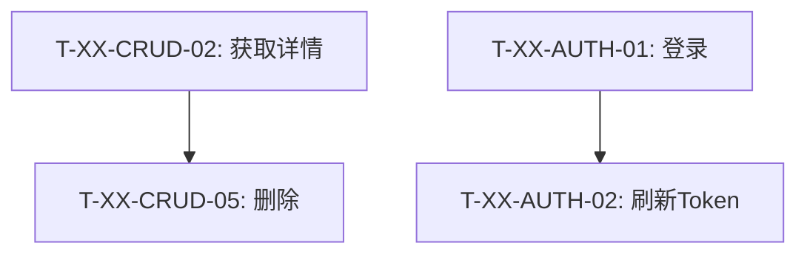

# MMB 任务拆解技能

根据功能设计文档生成符合 MMB 框架规范的任务拆解文档。

## 核心原则

**CRUD 任务优先**：首先识别标准 CRUD 任务，这是大多数业务模块的基础。

## CRUD 任务识别规则

标准 CRUD 任务包含以下操作（按功能设计文档中的命名约定）：

| 操作 | 关键词 | 功能编号示例 |
|------|--------|-------------|
| **C**reate | 添加、创建、新增 | F-X.1, F-X.2 |
| **R**ead | 获取XXX列表、获取XXX详情 | F-X.3, F-X.4 |
| **U**pdate | 修改、编辑 | F-X.5 |
| **D**elete | 删除 | F-X.6 |

## 无 CRUD 任务的特别说明

如果模块不存在标准 CRUD 任务，必须在文档开头添加：

```markdown
> **特别说明**：该模块不涉及标准CRUD任务，所有任务均为业务特定任务。
```

## 任务分组结构

```markdown
## 一、标准CRUD任务
（如果存在）

## 二、其他业务任务
（按业务逻辑分组，如：认证授权、密码管理、状态管理等）
```

## 任务编号规则

格式：`T-{模块缩写}-{类别缩写}-{序号}`

| 组成部分 | 规则 | 示例 |
|---------|------|------|
| 模块缩写 | 从模块名提取 2-4 个大写字母 | UM=UserManagement, CM=CategoryManagement, FM=FlowchartManagement |
| 类别缩写 | CRUD, AUTH, PWD, STATUS, PROFILE, UPLOAD 等 | CRUD, AUTH |
| 序号 | 两位数字，从 01 开始 | 01, 02, 03 |

完整示例：`T-UM-CRUD-01`, `T-UM-AUTH-01`, `T-CM-CRUD-01`

## 每个任务包含的字段

```markdown
### T-{模块}-{类别}-{序号}：任务名称

**功能编号**：F-X.X

**任务描述**：
简洁描述任务目标

**前置条件**：
- [ ] 依赖任务编号（如有依赖）

**验收标准**：
- [ ] 验收项1
- [ ] 验收项2

**参考**：功能设计文档 第 XX-XX 行
```

## 任务依赖关系

使用 Mermaid 图表展示任务间的依赖关系：



## 开发顺序建议

按以下优先级排列：

1. **第一阶段**：标准CRUD任务（如存在）
2. **第二阶段**：认证/基础任务
3. **第三阶段**：扩展功能

## 完成标准

模块级完成标准：

- [ ] 所有相关接口全部实现
- [ ] 权限控制正确实现
- [ ] 错误处理完善
- [ ] API文档完善

## 工作流程

1. 读取功能设计文档 (FunctionalDesign.md)
2. 识别标准 CRUD 任务
3. 识别其他业务任务
4. 确定任务依赖关系
5. 生成任务拆解文档

## 模板参考

任务拆解模板：[@.claude/skills/mmb-task-decomposition/assets/TaskDecomposition.template.md](assets/TaskDecomposition.template.md)

## 输出文件

任务拆解文档应保存在：`ZhiTu.{ModuleName}/docs/Tasks/{ModuleName}.md`
