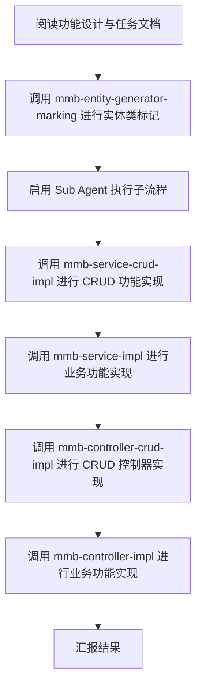

# MMB 任务实现编排技能

按统一流程推进 MMB 任务实现，减少遗漏与顺序错误。  
严格按“检索 -> 标记 -> 串行实现 -> 汇报”执行，不基于记忆臆断框架细节。

## 执行约束
1. 优先基于检索推理：先读取功能设计文档、任务文档、现有代码与相关技能，再做实现决策。
2. 禁止修改任何 `MGC` 目录下文件。
3. 严格串行执行子流程，不并行跳步。
4. 若某步骤不适用，明确写出“跳过原因”和“影响范围”。
5. 每个步骤结束后，记录产出文件与关键决策。
6. 若项目已启用全局默认鉴权，控制器层不添加无必要的裸 `[Authorize]`。

## 主流程
按以下顺序执行：
1. 阅读功能设计与任务文档
2. 调用 `mmb-entity-generator-marking` 进行实体类标记
3. 启用 Sub Agent（或等价子执行单元）串行执行子流程
4. 汇报结果

## 步骤 1：阅读功能设计与任务文档
1. 定位并读取功能设计文档、任务文档、模块目录结构。
2. 抽取本次实现清单：
   - 实体清单
   - 标准 CRUD 任务清单
   - 非标准业务任务清单
3. 标记依赖关系与先后顺序。
4. 输出“执行输入摘要”，作为后续步骤输入。

## 步骤 2：执行实体标记
调用 `mmb-entity-generator-marking`，对实体进行代码生成控制特性标记。  
目标是让后续服务/控制器生成与任务边界一致。

执行后检查：
1. 标记是否覆盖所有目标实体。
2. 标记是否与任务文档一致（如仅业务接口实体是否禁用 CRUD 生成）。
3. 变更是否触及 `MGC` 目录（若触及立即回退并改为正确路径）。
4. Tree/Index 鉴权需要统一策略时，是否已评估并标记 `NotTreeController` / `NotIndexController`。

## 步骤 3：Sub Agent 串行子流程
Sub Agent 的唯一职责是执行单步实现并返回结构化摘要，不向主流程回灌无关上下文。  
使用 Sub Agent 的目标：
1. 隔离上下文，避免主流程被实现细节污染。
2. 控制上下文体积与令牌开销。
3. 支持单步骤失败重试，降低全链路回滚成本。
4. 固化步骤级摘要，提升过程可审计性。

按 3.1 -> 3.2 -> 3.3 -> 3.4 顺序执行，不得调整顺序。

### 3.1 调用 `mmb-service-crud-impl`
实现标准 CRUD 服务能力。  
若任务中无标准 CRUD，明确写“本步骤跳过：无标准 CRUD 任务”。

### 3.2 调用 `mmb-service-impl`
实现非标准业务服务能力（扩展方法、服务模型、按需 DTO、事务处理）。

### 3.3 调用 `mmb-controller-crud-impl`
在需要时介入标准 CRUD 控制器行为（如请求级字段注入、特殊权限、返回处理）。
默认鉴权项目中，仅在“公开接口”或“策略升级”场景显式添加特性。

### 3.4 调用 `mmb-controller-impl`
实现非标准控制器能力（聚合编排、文件流、特殊路由/鉴权、非标准动作）。
Tree/Index 统一策略需求优先走“实体标记抑制生成 + 手写控制器”路径，不使用后置 Filter 补丁。

### 3.5 子流程汇总
汇总 3.1-3.4 的文件变更、完成状态、阻塞项，交回主流程。

## 步骤 4：汇报结果
汇报结果必须保存到 `docs/Tasks` 目录。  
文件名格式：`{任务清单文件名}完成报告{yyyyMMddHHmmss}.md`。  
示例：任务清单为 `UserManagement.md`，则报告文件名为 `UserManagement完成报告20260210153000.md`。

按以下模板汇报：

1. 任务输入摘要
   - 功能文档与任务文档来源
   - 涉及模块与实体
2. 执行结果
   - `mmb-entity-generator-marking`：完成/跳过 + 说明
   - `mmb-service-crud-impl`：完成/跳过 + 说明
   - `mmb-service-impl`：完成/跳过 + 说明
   - `mmb-controller-crud-impl`：完成/跳过 + 说明
   - `mmb-controller-impl`：完成/跳过 + 说明
3. 变更清单
   - 文件路径列表
   - 每个文件的关键改动点
4. 风险与阻塞
   - 未完成项
   - 依赖项或待确认项
5. 下一步建议
   - 代码生成/构建/测试建议
   - 文档补充建议（如需要）

## 质量检查清单
- 是否完整执行“1 -> 2 -> 3(3.1~3.5) -> 4”。
- 是否在每一步都采用检索证据而非记忆猜测。
- 是否保持 `MGC` 目录零改动。
- 是否明确记录跳过原因与影响范围。
- 是否给出可追踪的文件级变更与后续建议。
- 是否避免无必要裸 `[Authorize]`。
- Tree/Index 统一策略场景是否优先使用 `NotTreeController` / `NotIndexController`。

## 流程图（实现顺序）

